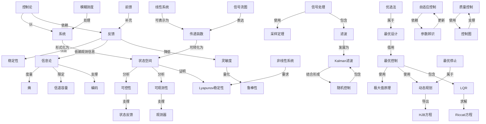

# 知识图谱

```mermaid
graph TD
  控制论["控制论"] -->|以| 系统["系统"]
  控制论["控制论"] -->|依赖| 反馈["反馈"]
  反馈["反馈"] -->|改善| 稳定性["稳定性"]
  反馈["反馈"] -->|依赖观测信息| 信息论["信息论"]
  前馈["前馈"] -->|补充| 反馈["反馈"]
  信息论["信息论"] -->|度量| 熵["熵"]
  信息论["信息论"] -->|限定| 信道容量["信道容量"]
  信息论["信息论"] -->|支撑| 编码["编码"]
  信号处理["信号处理"] -->|使用| 采样定理["采样定理"]
  信号处理["信号处理"] -->|包含| 滤波["滤波"]
  滤波["滤波"] -->|发展为| Kalman滤波["Kalman滤波"]
  系统["系统"] -->|形式化为| 状态空间["状态空间"]
  状态空间["状态空间"] -->|分析| 可控性["可控性"]
  状态空间["状态空间"] -->|分析| 可观测性["可观测性"]
  可控性["可控性"] -->|支撑| 状态反馈["状态反馈"]
  可观测性["可观测性"] -->|支撑| 观测器["观测器"]
  状态空间["状态空间"] -->|证明| Lyapunov稳定性["Lyapunov稳定性"]
  线性系统["线性系统"] -->|可表示为| 传递函数["传递函数"]
  传递函数["传递函数"] -->|可转化为| 状态空间["状态空间"]
  非线性系统["非线性系统"] -->|要求| Lyapunov稳定性["Lyapunov稳定性"]
  信号流图["信号流图"] -->|表达| 传递函数["传递函数"]
  最优控制["最优控制"] -->|使用| 极大值原理["极大值原理"]
  最优控制["最优控制"] -->|使用| 动态规划["动态规划"]
  动态规划["动态规划"] -->|导出| HJB方程["HJB方程"]
  最优控制["最优控制"] -->|包含| LQR["LQR"]
  LQR["LQR"] -->|求解| Riccati方程["Riccati方程"]
  Kalman滤波["Kalman滤波"] -->|结合形成| 随机控制["随机控制"]
  随机控制["随机控制"] -->|包含| Kalman滤波["Kalman滤波"]
  自适应控制["自适应控制"] -->|依赖| 参数辨识["参数辨识"]
  参数辨识["参数辨识"] -->|更新| 自适应控制["自适应控制"]
  灵敏度["灵敏度"] -->|量化| 鲁棒性["鲁棒性"]
  反馈["反馈"] -->|降低| 灵敏度["灵敏度"]
  优选法["优选法"] -->|属于| 最优设计["最优设计"]
  最优停止["最优停止"] -->|属于| 动态规划["动态规划"]
  最优设计["最优设计"] -->|借用| 最优控制["最优控制"]
  模糊测度["模糊测度"] -->|处理| 系统["系统"]
  质量控制["质量控制"] -->|使用| 控制图["控制图"]
  控制图["控制图"] -->|支撑| 质量控制["质量控制"]
```
