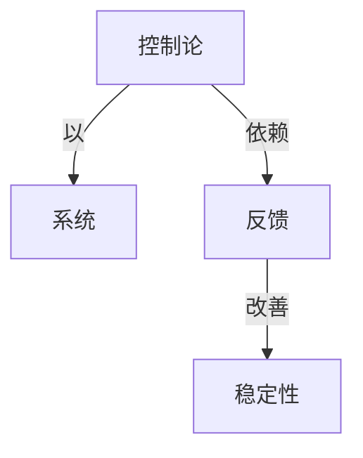

# 优选学

**PDF**：`C:\Users\AJ\Documents\Codex\2026-05-28\https-github-com-yangjin2021-think-model-2\[控制论].[优选学].（华罗庚）.pdf`  
**全文 OCR**：[[03-ocr-fulltext-OCR全文/01-优选学]]  
**重点概念**：[[05-concept-cards-概念卡片/稳定性]]、[[05-concept-cards-概念卡片/反馈]]、[[05-concept-cards-概念卡片/系统]]、[[05-concept-cards-概念卡片/控制论]]、[[05-concept-cards-概念卡片/优选法]]、[[05-concept-cards-概念卡片/线性系统]]

## 本书定位

以少量试验逼近工程和生产中的较优方案，强调单峰性、序贯试验和群众化推广。

## 整理大纲

1. 优选问题与单峰假设
2. 黄金分割/分数法
3. 多因素优选
4. 批量试验与工程约束
5. 生产实践推广

## OCR 识别到的目录/章节线索

- 51.912
- 1981 .3:
- 序言
- 第一章黄金分割法和分数法
- 51.有限点的问题—分数法
- 52.F的解析表达式…….
- 53.黄金分期法
- 4.来回调试法
- 55.黄金分割法的最优性
- 56.连分数的知识
- 7.连分数与来回调试法（一）
- 8.连分数与案回调试法（二）
- 第二章抛物线法
- 51.第一种方法
- 2.误差估计.
- 54.C,的表达式
- 55.第三种方法
- 第三章分批试验及其他
- 51.试验方案优劣的衡量标准
- 2.一组特殊的方程组的解法
- 53.每批作资数个试验，如何安排·
- 54.每批作偶数个试验，如何安排
- 5.一般情形，如何安排…
- 56.试验批数不定的情形
- 57.是否最好的安排
- 5.8.依某种要求进行试验
- 5.9.重复性试验的分鳞问题
- 10.非单蜂的情形如何办
- 第一章双因素优选法
- 51.对开法
- 52.旋升法…
- 3.平行线法
- 54.两个因素的离散情形
- 55.翻筋斗法
- 第二章最陡上升法
- 1.最陡上升法
- 2.新近陡升法
- 53.二次模拟……
- 54.反向 Schwarz 不等式….
- 5.收效因子的进一步改进
- 第三章切块法
- 1.一个几何不等式（二维）
- 52.维饿形的体积与重心
- 53.对称化.….……
- 55.拉…..
- 56.说明
- 第四章二次退归法评介
- 51.背景
- 52.二次.归…
- 53.个因素的问题
- 54.讨论…
- 第五章抛物体法
- 1.矩阵符号…
- 52.方法的背景
- 53.两条定理
- 54.有效性
- 55.补充方法
- 第六章与计算数学的关系·
- 1.问题的叙述…
- 52.黄金分割法的计算格式
- 3.对开法…….
- 4.旋升法
- 5.数值微分法
- 6.方程组的数值解
- 57.求重心………
- 附录一度量问题
- 附录二与后道工艺过程无关的优选法
- 附录三一致分布点寻优法
- 附录四
- 附录五
- 附录六
- 附录七
- 附录八重复试验
- 附录九0-1变元法
- 0.6180339887..
- 1.有限点的问题--分数法
- 1.做二次试验（n=2），只能在两个点中分辨，因此Φ=2.
- 57.连分数与来回调试法（一）
- 1.若
- 1.若这样的A多于个（在下面定出），当·充分

## 重要理论与工具

- 优选法
- 黄金分割法
- Fibonacci 分割
- 序贯决策
- 试验设计

## 重点概念频次

- [[05-concept-cards-概念卡片/优选法]]：130
- [[05-concept-cards-概念卡片/线性系统]]：5

## 理论关系链接

- [[05-concept-cards-概念卡片/控制论]] --以--> [[05-concept-cards-概念卡片/系统]]
- [[05-concept-cards-概念卡片/控制论]] --依赖--> [[05-concept-cards-概念卡片/反馈]]
- [[05-concept-cards-概念卡片/反馈]] --改善--> [[05-concept-cards-概念卡片/稳定性]]

## OCR 证据摘录

### [[05-concept-cards-概念卡片/优选法]]
> 本书介绍优选学方面的一些常见的方法，全节共分三部分，第一
> 部分单因素优选法，主要是介绍黄金分割法、分数法和抛物线法，第二
> 部分多因素优选法，主要是介绍双因素优选法、最健上升法、切块法、二
### [[05-concept-cards-概念卡片/线性系统]]
> 2.线性方程组求解
> 作为其广文解，定即时请症意，这仅对已知与p确有线性
> 广又逆的方进(或线性最归)来处都，由于线性酒款在任一存
