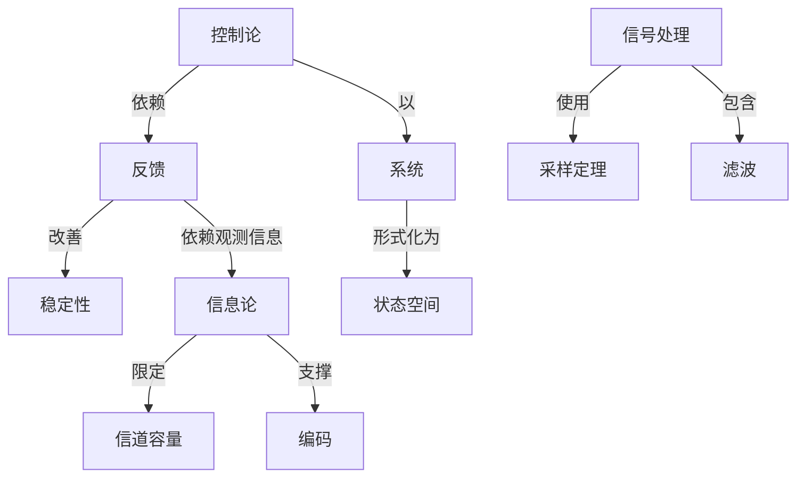

# 信号、信息与系统

**PDF**：`C:\Users\AJ\Documents\Codex\2026-05-28\https-github-com-yangjin2021-think-model-2\[控制论].[信号、信息与系统].pdf`  
**全文 OCR**：[[03-ocr-fulltext-OCR全文/02-信号-信息与系统]]  
**重点概念**：[[05-concept-cards-概念卡片/反馈]]、[[05-concept-cards-概念卡片/控制论]]、[[05-concept-cards-概念卡片/系统]]、[[05-concept-cards-概念卡片/线性系统]]、[[05-concept-cards-概念卡片/信号处理]]、[[05-concept-cards-概念卡片/状态空间]]、[[05-concept-cards-概念卡片/编码]]、[[05-concept-cards-概念卡片/信道容量]]、[[05-concept-cards-概念卡片/非线性系统]]、[[05-concept-cards-概念卡片/稳定性]]、[[05-concept-cards-概念卡片/采样定理]]、[[05-concept-cards-概念卡片/信息论]]、[[05-concept-cards-概念卡片/滤波]]、[[05-concept-cards-概念卡片/随机控制]]

## 本书定位

把信号表示、信息度量和系统响应联成通信与控制的共同基础。

## 整理大纲

1. 信号分类与变换
2. 线性系统与卷积
3. 信息量与熵
4. 噪声信道与编码
5. 系统响应与控制应用

## OCR 识别到的目录/章节线索

- 前言
- 六、、十三、西章由五新写，第、十次、十七、十八事虫
- 目录
- 第一篇
- 第二章
- 2.4
- 3.2零输入和应及传物算子解获…
- 第四章
- 第五章
- 11.2
- 第六章
- 第二篇变换域分析
- 第七章银域分析
- 57.1特星叶银靠与离教
- 57.2得至叶变换与连续频读
- 第八章
- 第九章
- 第十章
- 第十一章随机偿号
- 第十二章
- 12.4
- 第十三章
- 第四篇
- 第十六章
- 第十七章
- 17.3真拉央特不等式
- 517.7编效率及余量
- 第十八章线性所储码介组
- 51.1判新则及错误本
- 2.29
- 绪论
- 50.1消息、信号、信息与系统
- 0.2信号的描述及其分类
- 1.连续信号
- 1. = & + j9
- 2.离教信号
- 0.3信号的分解
- 1.连读他号的分解
- 2.真数值号的分解
- 50.4系统的模型及状态
- 0.5系统的分类及其分析方法综述
- 1.连续系统和离散系统
- 2.经性系统与非线性系统
- 3.时不系统和财空系统
- 4.单心参款系统和分布参款系统
- 5.时系统与动态系统
- 6.多验入、多输出系统
- 7.医果系统与非因际系统
- 2、处观有控实美基本是方世一门斯为学料。它的应用
- 第一篇时域分析
- 第一章卷积与卷积和
- 1.1卷积与卷积和的定文及图形解释
- 1.室又
- 2.形降
- 51.2额与卷积和的运算报则
- 1.代数
- 2.分和整分经其
- (1.(b)f(n + 1 k) = f,(i)f. (s i )
- 3.积分和章和运算
- 1.（x）4
- 4.与冲激号的春积
- 51.3相积与卷积和的计算方法
- 1.连续第号卷积的计筹方法
- 2.有款价号积和的补其方法
- 4.79
- (1).i年
- 第二章连续系统的输入
- 52.1微分方程的建立及其算于特号表示
- 0.1. -,), =(1)
- 52.4零状本响应
- 4.IF
- 4.了()时展规的公响应。
- 第三章离散系统的输入
- 3.1差分方程的建立及其算子特号表示
- 53.2零输入响应及传输算子解法
- 3.3单位样值确应
- 2.求等状态响岛
- 55.5单位阶跃序列响应与单位样值响应的关系
- 第四章连续系统的状态变量分析法
- 4.1状态卖量和状态方程

## 重要理论与工具

- 傅里叶/拉普拉斯变换
- 线性系统
- 信息论
- 采样定理
- 信道容量

## 重点概念频次

- [[05-concept-cards-概念卡片/系统]]：640
- [[05-concept-cards-概念卡片/线性系统]]：352
- [[05-concept-cards-概念卡片/信号处理]]：300
- [[05-concept-cards-概念卡片/状态空间]]：254
- [[05-concept-cards-概念卡片/编码]]：73
- [[05-concept-cards-概念卡片/信道容量]]：58
- [[05-concept-cards-概念卡片/非线性系统]]：48
- [[05-concept-cards-概念卡片/稳定性]]：35
- [[05-concept-cards-概念卡片/采样定理]]：17
- [[05-concept-cards-概念卡片/信息论]]：13
- [[05-concept-cards-概念卡片/滤波]]：10
- [[05-concept-cards-概念卡片/随机控制]]：3

## 理论关系链接

- [[05-concept-cards-概念卡片/控制论]] --以--> [[05-concept-cards-概念卡片/系统]]
- [[05-concept-cards-概念卡片/控制论]] --依赖--> [[05-concept-cards-概念卡片/反馈]]
- [[05-concept-cards-概念卡片/反馈]] --改善--> [[05-concept-cards-概念卡片/稳定性]]
- [[05-concept-cards-概念卡片/反馈]] --依赖观测信息--> [[05-concept-cards-概念卡片/信息论]]
- [[05-concept-cards-概念卡片/信息论]] --限定--> [[05-concept-cards-概念卡片/信道容量]]
- [[05-concept-cards-概念卡片/信息论]] --支撑--> [[05-concept-cards-概念卡片/编码]]
- [[05-concept-cards-概念卡片/信号处理]] --使用--> [[05-concept-cards-概念卡片/采样定理]]
- [[05-concept-cards-概念卡片/信号处理]] --包含--> [[05-concept-cards-概念卡片/滤波]]
- [[05-concept-cards-概念卡片/系统]] --形式化为--> [[05-concept-cards-概念卡片/状态空间]]

## OCR 证据摘录

### [[05-concept-cards-概念卡片/系统]]
> 信号：信息与系统
> 信号、信息与系统
> 本书内容包哲连维供号与系统、离散售号与系院、确定信号与随机售号、载
### [[05-concept-cards-概念卡片/线性系统]]
> 性系统与非线性系统、时城与变换城的基本理论与基本分析方法以及现代信息论
> 系状、高教号与系状、确定价号与机资号、线性系就与导城性系
> 本民题：在时填分析一箱中，分经线性系健的输入输自分析法与状
### [[05-concept-cards-概念卡片/信号处理]]
> 信号：信息与系统
> 信号、信息与系统
> 本书内容包哲连维供号与系统、离散售号与系院、确定信号与随机售号、载
### [[05-concept-cards-概念卡片/状态空间]]
> 连建系统的状态变分折法
> 状态安量和状态方型
> 状态方程的城……
### [[05-concept-cards-概念卡片/编码]]
> 537,1编码余起
> 球冲信号、编码位号等等。所以，可以这样说，信号是消息的
> 及编码等基本损念和其不问题，从面为学习《通份系统》，《控
### [[05-concept-cards-概念卡片/信道容量]]
> 客。设板距离为4，其容量C等子
> 和最小容量分别为
> 4改变量为d，则最大网题为d+44，医此买最大容量
### [[05-concept-cards-概念卡片/非线性系统]]
> 性系统与非线性系统、时城与变换城的基本理论与基本分析方法以及现代信息论
> 变量分积法以及非线性系统的时减分积法，在交员城分析一等中，介
> 随机信号与爆声通过非线性系统
### [[05-concept-cards-概念卡片/稳定性]]
> 所调稳定系统是图（1）润足地对可积条件的系统，即
> 式（3一36）就是稳定的因来系恢的充分必要条作，这一条件
> 的物组意文是：有期能量信号加入一个稳定的因是系统，那会
