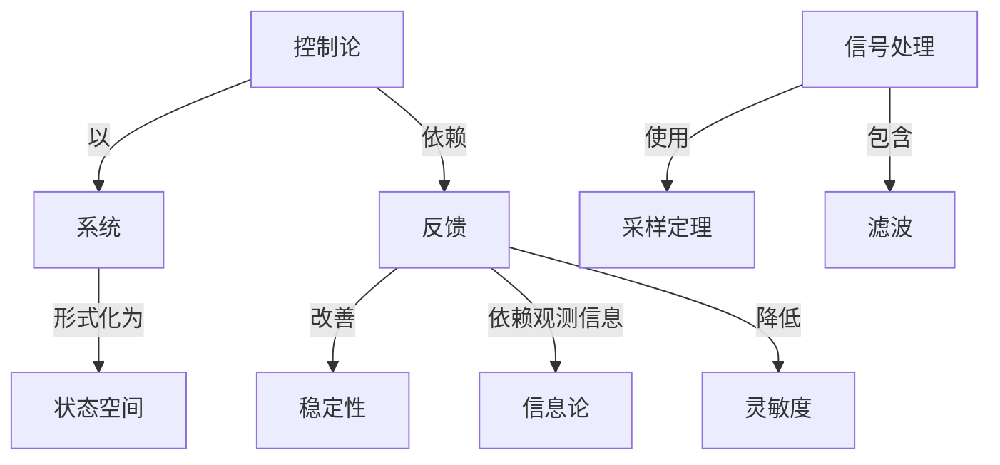

# 信号流图和系统

**PDF**：`C:\Users\AJ\Documents\Codex\2026-05-28\https-github-com-yangjin2021-think-model-2\[控制论].[信号流图和系统].pdf`  
**全文 OCR**：[[03-ocr-fulltext-OCR全文/04-信号流图和系统]]  
**重点概念**：[[05-concept-cards-概念卡片/信号处理]]、[[05-concept-cards-概念卡片/系统]]、[[05-concept-cards-概念卡片/信号流图]]、[[05-concept-cards-概念卡片/状态空间]]、[[05-concept-cards-概念卡片/采样定理]]、[[05-concept-cards-概念卡片/线性系统]]、[[05-concept-cards-概念卡片/反馈]]、[[05-concept-cards-概念卡片/灵敏度]]、[[05-concept-cards-概念卡片/稳定性]]、[[05-concept-cards-概念卡片/随机控制]]、[[05-concept-cards-概念卡片/控制论]]、[[05-concept-cards-概念卡片/信息论]]、[[05-concept-cards-概念卡片/滤波]]、[[05-concept-cards-概念卡片/非线性系统]]、[[05-concept-cards-概念卡片/质量控制]]

## 本书定位

用图结构统一表示系统变量关系、传递函数和反馈环路。

## 整理大纲

1. 节点支路和增益
2. 路径和回路
3. Mason 公式
4. 反馈系统化简
5. 多变量系统图分析

## OCR 识别到的目录/章节线索

- 198.8
- 前言
- 第二章
- 第四章
- 第五章
- 第六章
- 6.3
- 第七章
- 第一章信号流图的基本理论
- 1.支路并联简化规则
- 2.支路串联简化规则
- 3.支路移动规则一节点的吸收
- 4.自环消除规则
- 1.从源点出发的支路的反向
- 1.若支路i的起点是节点
- 0.否则
- 2.这载是式（1-56）中约）同项1积f
- 1.单环的生成步骤
- 1.类的斯朴笑化期则：这规账对了对强进行智步其名
- 2.环的产坐：这里产业由头定能的最小本征泉别必要的部
- 1.3
- 4.换定量小水至量
- 94)、(1-95)的B之8,a可册
- 1.2·，K，..）与对虚的补通的面行N式之明家起，
- 2.支路市联岗化版到（1-63）
- 3.文路移动流府节点的级农（图1-65）
- 1.图环法
- 2.是优斯补
- 1.从图G产生连换表，连接表均行数等于世的节点数，每行
- 2.以汇点作为视出发，应用连额表可生成OTM新：
- 4.从OTM树中可排出有序本在节点的节点图子，一般，
- 4.5
- 2.4
- 23.从节点4出发，生成树核和7，因为本征节点1和1间
- 第二章有源网络分析
- 7.承链支路电压VF再图xCL，文路电流L表
- 0、再将A中国子
- 第三章有源网络综合
- 33.求面336所示的大低通排波香的货号宽图
- 0.567
- 1.D) 的实死
- 8.4 4, M, = R =1 成2时,C些图恒为空风
- 2.MG)的实强
- 1.2,#1和=时NG）的实比数均为1.改N()的全部买
- 1. LBI/DF 二阶节结构
- 2.BH/DP二册节结称
- 3.MI/DF二节购
- 2. Pry=/e ieeteer, Va. N6, Ns 4/% Pe. ti5-=IIN, 1S8a.
- 第四章贝敏度
- 7.9462-7
- 0.82
- 1.求灵款度的信号近图提型
- 1.如果节点F是支路的驱点
- 2.买单度的游求示
- 3.新补公式
- 1、7是
- 七. Citine Tieety d eyhineim, Wa. 1, o. 75-8t, 1916.
- 第五章离散系统
- 4., = 9,
- 1.51人下列号：
- 1.验人文路加到节点2，改期加的输人行中第2到的元素为
- 7.很具有不润的能前东冠近元作，图5-22表示两个采样系比，
- 1.老电家同络分析
- 2.多权开类电客月导分折
- 2.016(2°+ 32'+32_+1)
- 1.524 + 1 = 3.524,
- 2.429,
- 第六章反馈系统
- 9.其等驰电路知西66
- 2.1号
- 0.09386？
- 45.39
- 942.507
- 99.782
- 15.59
- 42.894
- 2462.29
- 42.3341
- 9.06713]
- 42.884

## 重要理论与工具

- 信号流图
- Mason 增益公式
- 传递函数
- 反馈回路
- 线性方程组

## 重点概念频次

- [[05-concept-cards-概念卡片/信号处理]]：206
- [[05-concept-cards-概念卡片/系统]]：120
- [[05-concept-cards-概念卡片/信号流图]]：89
- [[05-concept-cards-概念卡片/状态空间]]：62
- [[05-concept-cards-概念卡片/采样定理]]：56
- [[05-concept-cards-概念卡片/线性系统]]：26
- [[05-concept-cards-概念卡片/反馈]]：25
- [[05-concept-cards-概念卡片/灵敏度]]：24
- [[05-concept-cards-概念卡片/稳定性]]：4
- [[05-concept-cards-概念卡片/随机控制]]：3
- [[05-concept-cards-概念卡片/控制论]]：1
- [[05-concept-cards-概念卡片/信息论]]：1
- [[05-concept-cards-概念卡片/滤波]]：1
- [[05-concept-cards-概念卡片/非线性系统]]：1
- [[05-concept-cards-概念卡片/质量控制]]：1

## 理论关系链接

- [[05-concept-cards-概念卡片/控制论]] --以--> [[05-concept-cards-概念卡片/系统]]
- [[05-concept-cards-概念卡片/控制论]] --依赖--> [[05-concept-cards-概念卡片/反馈]]
- [[05-concept-cards-概念卡片/反馈]] --改善--> [[05-concept-cards-概念卡片/稳定性]]
- [[05-concept-cards-概念卡片/反馈]] --依赖观测信息--> [[05-concept-cards-概念卡片/信息论]]
- [[05-concept-cards-概念卡片/信号处理]] --使用--> [[05-concept-cards-概念卡片/采样定理]]
- [[05-concept-cards-概念卡片/信号处理]] --包含--> [[05-concept-cards-概念卡片/滤波]]
- [[05-concept-cards-概念卡片/系统]] --形式化为--> [[05-concept-cards-概念卡片/状态空间]]
- [[05-concept-cards-概念卡片/反馈]] --降低--> [[05-concept-cards-概念卡片/灵敏度]]

## OCR 证据摘录

### [[05-concept-cards-概念卡片/信号处理]]
> 本书以七章的施幅介绍了信号流图的基本距论，号液图在明络分析、
> 信号流图是以图的形式表示线性方程组的变量间相互关系的
> 于1953年系统地建立了信号流图理论以来，其应用范围已从电工
### [[05-concept-cards-概念卡片/系统]]
> 购络综合、离散系续、反馈系统及随视系统中的应用，并讨论了用拓扑方法
> 计算系统灵缴度的问题全书内客全面、系统，在介绍应用方法的同时，列
> 本书可供电于、电工、自动化、系统工程、应用图论、管理料学等方面的
### [[05-concept-cards-概念卡片/信号流图]]
> 本书以七章的施幅介绍了信号流图的基本距论，号液图在明络分析、
> 信号流图是以图的形式表示线性方程组的变量间相互关系的
> 便，它是对线性系统进行构模和分析的有用工具.从S.J.Mason
### [[05-concept-cards-概念卡片/状态空间]]
> 状态方程的建立.
> 2-4状态方程的建立
> 我标名压的间时的就决之了间对状态，值是，买决定润时状述，井
### [[05-concept-cards-概念卡片/采样定理]]
> 信号流图在离散系统中的应用.包括分析采样系统的三种方法，
> 多速采样系统的分析，以及开关电容网络的分析和综合，第六章
> 本章格讨论离歌（采样）系桃，这种系统中不仅包桥连膜变量，西
### [[05-concept-cards-概念卡片/线性系统]]
> 信号流图是以图的形式表示线性方程组的变量间相互关系的
> 便，它是对线性系统进行构模和分析的有用工具.从S.J.Mason
> 者只需具备线性代数和简单的图论知识即可无因难地阅读本书的
### [[05-concept-cards-概念卡片/反馈]]
> 购络综合、离散系续、反馈系统及随视系统中的应用，并讨论了用拓扑方法
> 利用信号流图模型研究反馈系统，并由此指出，用信号流图可简便
> 地推导出反馈理论中的一些定理，第七章论述随机系统，用信号
### [[05-concept-cards-概念卡片/灵敏度]]
> 合问题，第四章闻述用拓扑方法计算灵敏度的间题，第五章讨论
> 灵敏度及其有关定理
> 计算灵敏度的拓扑公式
### [[05-concept-cards-概念卡片/稳定性]]
> 式在讨论稳定度时是很有用的
> 输系数息是负约，可以增加有原电真的稳定实，典句语说，有用达
> 一符考录定，就设有必受检查有距电路中每个负区银环的稳定度，
### [[05-concept-cards-概念卡片/随机控制]]
> 地推导出反馈理论中的一些定理，第七章论述随机系统，用信号
