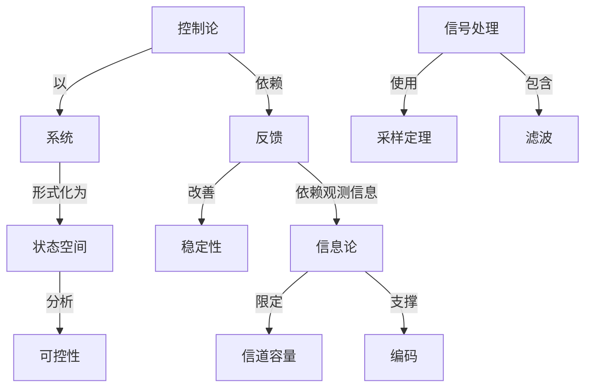

# 控制论-信息论-系统科学与哲学-第二版

**PDF**：`C:\Users\AJ\Documents\Codex\2026-05-28\https-github-com-yangjin2021-think-model-2\[控制论].[控制论-信息论-系统科学与哲学-第二版].pdf`  
**全文 OCR**：[[03-ocr-fulltext-OCR全文/09-控制论-信息论-系统科学与哲学-第二版]]  
**重点概念**：[[05-concept-cards-概念卡片/系统]]、[[05-concept-cards-概念卡片/控制论]]、[[05-concept-cards-概念卡片/状态空间]]、[[05-concept-cards-概念卡片/稳定性]]、[[05-concept-cards-概念卡片/线性系统]]、[[05-concept-cards-概念卡片/信息论]]、[[05-concept-cards-概念卡片/编码]]、[[05-concept-cards-概念卡片/信号处理]]、[[05-concept-cards-概念卡片/非线性系统]]、[[05-concept-cards-概念卡片/信道容量]]、[[05-concept-cards-概念卡片/反馈]]、[[05-concept-cards-概念卡片/可控性]]、[[05-concept-cards-概念卡片/最优控制]]、[[05-concept-cards-概念卡片/采样定理]]、[[05-concept-cards-概念卡片/随机控制]]、[[05-concept-cards-概念卡片/滤波]]

## 本书定位

从哲学和方法论层面说明控制、信息、系统科学对认识论的影响。

## 整理大纲

1. 控制论与信息论
2. 反馈和目的性
3. 系统整体性和层次性
4. 开放系统和自组织
5. 科学方法论

## OCR 识别到的目录/章节线索

- 目录
- 第一章控制论的形成与产生-
- 第三节
- 第三节经制论的产生与进展…
- 第一节制、行为与目的…
- 第三章控制论的一主要方
- 第二节4实6一自……
- 第二节生自论………
- 第三节桂、通论….……….…….……（82)
- 第五章控制论的哲与方法论网题…………
- 第二节
- 第六节
- (9.E)......*
- 第二节售思量与…………
- 第三节息论的内起究进是………………（298）
- 第九章你息论与镇息科华的应用…
- 第三节生是泌与理积…………………
- 第二节子生中、区争……
- 第四节学与现代.…
- 第十章息论与值息科学中的智学与方
- 第三篇系航科学的器本原念
- 第十一章系统工程和运筹学的形成与产……=…-（351）
- 第十二章系桃工程的本撕念与为法……
- 第十五章系能科学与系统方续
- 第二节热力学、总与生系次的进化……………（.39）
- 第十六章系统研究、系能科学的有学与方法
- 绪论
- 第一篇控制论的基本概念与
- 第一章控制论的形成与产生
- 第一节拉制论以前的自动装置与理论
- 1.3班示的蒸气肌纳上，身负有地加时转述减很，高心式机构的
- 第二节控制论产生的社会历史背景
- 第三节制论产生的理论
- 3.H.Jlecrares, Heeoropat wrreMwweeEe wtrngM sonc*
- 第四节暂学与方法论的研究
- 第五节控制论的产生与选展
- 第二章控制论的基本理论
- 第一节始制、行为与目
- 1.感觉（传人）行单求码，2.感记神提开原：3，骨的神量
- 第二节检制系统与位制论系统
- 1.室营控积富统：这疗第统中历单全的日标是领全的，电量
- 1.例属度。强皮指在网样输人下，输出面顾的板西程皮，
- 2.题定速成。稳堂通度者从和高状之转人稳定收之的送成。
- 3.稳定的准确度，无快稳定的教确度必根据物出值与给定的
- 第三节控制与信息
- 第四节控制论机与自动机
- 2. 4; s, L t.
- 1. t, 5, 5,
- 2.同，凡是将读写头向有移一格，这里要挂意的是，在一个提令
- 1.在注视方格上打印一个香号，（当热，在打印时也键把原
- 2.向左移动一格s
- 3.向右移动一格：
- 4.条件抽移，指波写头性视的方格内若为某特号，则转向某
- 1.一个初等放论的感式系虎r，如是是-无净盾的，那会它
- 2.如紧过一系是无子票的，那么其元子活性在本系统中不
- 第三章控制论的-些主要方法
- 第一节功能模拟方法
- 第二节黑箱一灰箱一白精方洪
- 1.先对箱子的推新和内容不作价何重定，包我们指定处理它
- 2.为院明合地以确定文可重现为方式那成，就必规念
- 3.采用一个长监安记表，记下输人和输出的一系列状志：
- 4.找松准表达式，有了很收的要记表以后，实验者就可以从
- 5.性学联系。用很导方品是岛买首的一我内高联系。
- 第三节形式化、数量化、最代化的方法
- 第四章控制论的应用与主要分支
- 第一节工程控制论
- 2.3线性不优理论
- 1.线性系能理论
- 5.自活定、自学习以及自组机系缺的理论
- 4.华价检制论：
- 7.火系统理论
- 3.候树性通论
- 9.其它月冠7.
- 5、6项主要属于现代控制理论的内容。7、9制主要属干火
- 一、经典挖制理论
- 2.通加性。验人为x（)（1)，与9别输人时，对应的
- 1.传通函紫方法。达种方法将微分方程变换为明应的代教方
- 2.乘率响应的。这是1532年泰在斯特（Fgmim）提出的。
- 3.根机连活.近种方读必伊文别Km在18单
- 二、观代腔制理论

## 重要理论与工具

- 系统哲学
- 反馈
- 信息
- 自组织
- 黑箱方法

## 重点概念频次

- [[05-concept-cards-概念卡片/系统]]：1165
- [[05-concept-cards-概念卡片/控制论]]：381
- [[05-concept-cards-概念卡片/状态空间]]：124
- [[05-concept-cards-概念卡片/稳定性]]：90
- [[05-concept-cards-概念卡片/线性系统]]：88
- [[05-concept-cards-概念卡片/信息论]]：41
- [[05-concept-cards-概念卡片/编码]]：31
- [[05-concept-cards-概念卡片/信号处理]]：28
- [[05-concept-cards-概念卡片/非线性系统]]：15
- [[05-concept-cards-概念卡片/信道容量]]：10
- [[05-concept-cards-概念卡片/反馈]]：7
- [[05-concept-cards-概念卡片/可控性]]：7
- [[05-concept-cards-概念卡片/最优控制]]：4
- [[05-concept-cards-概念卡片/采样定理]]：3
- [[05-concept-cards-概念卡片/随机控制]]：3
- [[05-concept-cards-概念卡片/滤波]]：2
- [[05-concept-cards-概念卡片/动态规划]]：2
- [[05-concept-cards-概念卡片/Lyapunov稳定性]]：1
- [[05-concept-cards-概念卡片/Kalman滤波]]：1
- [[05-concept-cards-概念卡片/质量控制]]：1

## 理论关系链接

- [[05-concept-cards-概念卡片/控制论]] --以--> [[05-concept-cards-概念卡片/系统]]
- [[05-concept-cards-概念卡片/控制论]] --依赖--> [[05-concept-cards-概念卡片/反馈]]
- [[05-concept-cards-概念卡片/反馈]] --改善--> [[05-concept-cards-概念卡片/稳定性]]
- [[05-concept-cards-概念卡片/反馈]] --依赖观测信息--> [[05-concept-cards-概念卡片/信息论]]
- [[05-concept-cards-概念卡片/信息论]] --限定--> [[05-concept-cards-概念卡片/信道容量]]
- [[05-concept-cards-概念卡片/信息论]] --支撑--> [[05-concept-cards-概念卡片/编码]]
- [[05-concept-cards-概念卡片/信号处理]] --使用--> [[05-concept-cards-概念卡片/采样定理]]
- [[05-concept-cards-概念卡片/信号处理]] --包含--> [[05-concept-cards-概念卡片/滤波]]
- [[05-concept-cards-概念卡片/系统]] --形式化为--> [[05-concept-cards-概念卡片/状态空间]]
- [[05-concept-cards-概念卡片/状态空间]] --分析--> [[05-concept-cards-概念卡片/可控性]]

## OCR 证据摘录

### [[05-concept-cards-概念卡片/系统]]
> XITONGKEXUE系统科学
> XITONGKEXUE系统科学
> 控制论、信息论、系统科学与暂学
### [[05-concept-cards-概念卡片/控制论]]
> KONGZHILUN控制论
> KONGZHILUN控制论
> 控制论、信息论、系统科学与暂学
### [[05-concept-cards-概念卡片/状态空间]]
> 大小总始一样的，成者说。神经元的属电位（即其状态）决堂中
> 为，总态是一种可变的、但又经靠始于机对稳定的状态，至是达
> 状态的名种不网位置和速度的账率分事、国为物理学的提量不可
### [[05-concept-cards-概念卡片/稳定性]]
> 为，总态是一种可变的、但又经靠始于机对稳定的状态，至是达
> 绿对负反他掌握得不好，因险品石验环了系就的稳定性，负改情
> 为付么会出现稳定性列题？这是现为自动控制系统是一种动
### [[05-concept-cards-概念卡片/线性系统]]
> 的，去就是具有线性头系，如录是一个通活系线，特况就不定会
> 最证与信号作用的大小一最是不在看比例安系或线性买系的。
> 2.3线性不优理论
### [[05-concept-cards-概念卡片/信息论]]
> XINXILUN信息论
> XINXILUN信息论
> 控制论、信息论、系统科学与暂学
### [[05-concept-cards-概念卡片/编码]]
> 个调节统路意味老，一方面，所知系块发放的信号，经这编码和
> 所课编码就总把位惠变换成售号的提施。“码*是什会附！
> 部分：一是位加编码，信原输码就是把情如输出的得号序列，用第
### [[05-concept-cards-概念卡片/信号处理]]
> 信号去控别大动率负载（功率实大），（4）在没有机城连损的
> 在于续者的目的出要不是继量的转换与处理，面是要使信号高频
> 如比，例如，有一遇位飞机，地面指年站通证无线电信号指挥
### [[05-concept-cards-概念卡片/非线性系统]]
> 性系线。事实上任网个系做基其有不别税度的非线性特性
> 专用于非线性系货的分析方统，它们一航都是查近位的方法，
> 对于非线性系统的稳定性的分析，也没有通用的为执在达
### [[05-concept-cards-概念卡片/信道容量]]
> 容量也大科多，每个神经元件的我腾度教显面其验合的可靠性限
> 码，然后转换成脉冲信号，衣信道中进行传运。
> 元导件款：无我信道，如自自点民、电真品等，在置条的电信态
