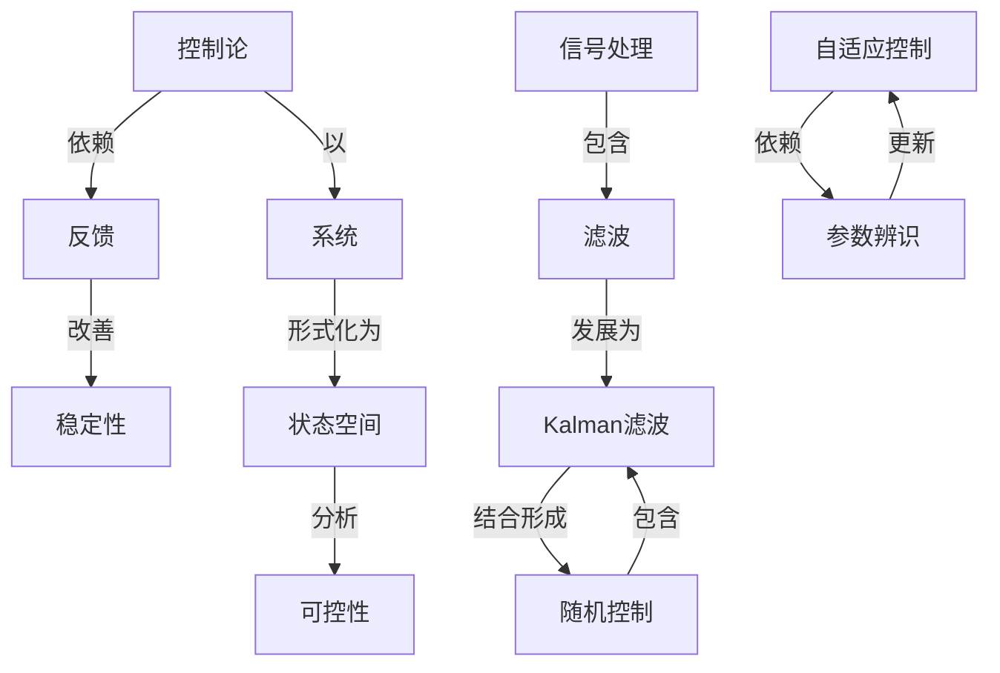

# 控制论基础

**PDF**：`C:\Users\AJ\Documents\Codex\2026-05-28\https-github-com-yangjin2021-think-model-2\[控制论].[控制论基础].pdf`  
**全文 OCR**：[[03-ocr-fulltext-OCR全文/10-控制论基础]]  
**重点概念**：[[05-concept-cards-概念卡片/系统]]、[[05-concept-cards-概念卡片/状态空间]]、[[05-concept-cards-概念卡片/线性系统]]、[[05-concept-cards-概念卡片/控制论]]、[[05-concept-cards-概念卡片/稳定性]]、[[05-concept-cards-概念卡片/最优控制]]、[[05-concept-cards-概念卡片/信号处理]]、[[05-concept-cards-概念卡片/非线性系统]]、[[05-concept-cards-概念卡片/随机控制]]、[[05-concept-cards-概念卡片/自适应控制]]、[[05-concept-cards-概念卡片/Kalman滤波]]、[[05-concept-cards-概念卡片/参数辨识]]、[[05-concept-cards-概念卡片/反馈]]、[[05-concept-cards-概念卡片/观测器]]、[[05-concept-cards-概念卡片/滤波]]、[[05-concept-cards-概念卡片/可控性]]

## 本书定位

介绍控制论的系统、输入输出、反馈、稳定和信息处理基础。

## 整理大纲

1. 系统和反馈
2. 动态建模
3. 稳定性
4. 信息传递
5. 控制论应用

## OCR 识别到的目录/章节线索

- 目录
- 1.1控制论的起源
- 1.2控制论的研究对象
- 1.3控需论的基本桥念
- 1.3.1信息
- 1.3..系统.
- 1.3.3控……….
- 2.1统计数学…
- 2.3语言学
- 2.4生物科学.
- 3.1动态系统描达的时域法
- 3.1.1动态系统的状态空间措述
- 3.1.2动态系统输入-输出关系的差分方程描述
- 3.1.3动态系统的脉冲响应措述…
- 3.2动态系统描述的频或法….….….….…….…..…
- 3.3系统的逻辑措述法…
- 3.3.2图灵机的描述…….
- 3.3.3自动机的概率描述*……
- 4.1系统辩识问题……
- 4.2系统的参数估计
- 4.3系统的非参数模型辨识……
- 4.3.1线性系统的脉冲响应辨识….
- 4.3.2非线性系统的非多数牌识
- 4.4系统的结构识….………
- 5.1状态空间分析法…
- 5.2房室分析法.……
- 5.2.1房密的定义….…....….
- 5.2.2房室的数学描述.…….….
- 5.3系统的稳定性.
- 5.4系统的能控性与能观性…
- 6.1最优控制问题的数学描述
- 6.2“最小值原理
- 6.2.1最小值原理的表述
- 6.2.2线性二次型最优调节器
- 6.3动态规划与离散系统的最优控制
- 6.3.2离数系统最优控制问题
- 7.1引言
- 7.2线性系统的状态观测器
- 7.2.1般观测器….….
- 7.2.2最小绘观测器
- 7.3卡尔滤波器……….
- 7.3.1最优估计问题...
- 7.3.2卡尔曼滤波公式
- 8.1.……
- 8.2随机控制问题的描述...
- 8.3最小方差控制..………..
- 8.4确定性等价原理和LQG问题的解
- 9.1基本概念.….…
- 9.1.1自适..
- 9.1.3自组织·
- 9.2自适应控制系统…
- 9.2.1自适应机的一般原理
- 9.2.2参考模型自适应控制系统.
- 9.2.3自校正.节器.…
- 9.3学习系统..
- 9.3.1学习的方式
- 9.3.2图形识别
- 9.3.3赛尔弗里奇的“群妖堂”
- 9.3.4再励学习系统……
- 9.4自组织系统
- 10.1引……
- 10.2大系统的本概念….…
- 10.3分解-协调方法…………
- 10.3.1分解-协调的基本思想
- 10.3.2线性大系统的连阶控制.
- 10.4分散控制..….…....
- 11.1
- 11.2模期集合论…
- 11.2.2分解定理与扩张原则
- 11.3模关系和模概系统..…..
- 11.3..1模关系.......….
- 11.3.3模期系统....
- 11.4模语言和近似推理
- 11.4.1模语言.…...…
- 11.4,2近似淮理
- 11.5模控制.…
- 11.5.1模控制器原理.
- 12.3工应封论办2内特·.
- 13.3企物系院分所
- 13.4.防管2姓买院-

## 重要理论与工具

- 反馈控制
- 黑箱方法
- 稳定性
- 自动机
- 信息传递

## 重点概念频次

- [[05-concept-cards-概念卡片/系统]]：527
- [[05-concept-cards-概念卡片/状态空间]]：156
- [[05-concept-cards-概念卡片/线性系统]]：125
- [[05-concept-cards-概念卡片/控制论]]：122
- [[05-concept-cards-概念卡片/稳定性]]：80
- [[05-concept-cards-概念卡片/最优控制]]：28
- [[05-concept-cards-概念卡片/信号处理]]：20
- [[05-concept-cards-概念卡片/非线性系统]]：20
- [[05-concept-cards-概念卡片/随机控制]]：16
- [[05-concept-cards-概念卡片/自适应控制]]：13
- [[05-concept-cards-概念卡片/Kalman滤波]]：12
- [[05-concept-cards-概念卡片/参数辨识]]：11
- [[05-concept-cards-概念卡片/反馈]]：6
- [[05-concept-cards-概念卡片/观测器]]：6
- [[05-concept-cards-概念卡片/滤波]]：5
- [[05-concept-cards-概念卡片/可控性]]：5
- [[05-concept-cards-概念卡片/LQR]]：4
- [[05-concept-cards-概念卡片/信道容量]]：2
- [[05-concept-cards-概念卡片/采样定理]]：2
- [[05-concept-cards-概念卡片/编码]]：1

## 理论关系链接

- [[05-concept-cards-概念卡片/控制论]] --以--> [[05-concept-cards-概念卡片/系统]]
- [[05-concept-cards-概念卡片/控制论]] --依赖--> [[05-concept-cards-概念卡片/反馈]]
- [[05-concept-cards-概念卡片/反馈]] --改善--> [[05-concept-cards-概念卡片/稳定性]]
- [[05-concept-cards-概念卡片/信号处理]] --包含--> [[05-concept-cards-概念卡片/滤波]]
- [[05-concept-cards-概念卡片/滤波]] --发展为--> [[05-concept-cards-概念卡片/Kalman滤波]]
- [[05-concept-cards-概念卡片/系统]] --形式化为--> [[05-concept-cards-概念卡片/状态空间]]
- [[05-concept-cards-概念卡片/状态空间]] --分析--> [[05-concept-cards-概念卡片/可控性]]
- [[05-concept-cards-概念卡片/Kalman滤波]] --结合形成--> [[05-concept-cards-概念卡片/随机控制]]
- [[05-concept-cards-概念卡片/随机控制]] --包含--> [[05-concept-cards-概念卡片/Kalman滤波]]
- [[05-concept-cards-概念卡片/自适应控制]] --依赖--> [[05-concept-cards-概念卡片/参数辨识]]
- [[05-concept-cards-概念卡片/参数辨识]] --更新--> [[05-concept-cards-概念卡片/自适应控制]]

## OCR 证据摘录

### [[05-concept-cards-概念卡片/系统]]
> 1.3..系统.
> 3.1动态系统描达的时域法
> 3.1.1动态系统的状态空间措述
### [[05-concept-cards-概念卡片/状态空间]]
> 3.1.1动态系统的状态空间措述
> 5.1状态空间分析法…
> 7.2线性系统的状态观测器
### [[05-concept-cards-概念卡片/线性系统]]
> 4.3.1线性系统的脉冲响应辨识….
> 4.3.2非线性系统的非多数牌识
> 6.2.2线性二次型最优调节器
### [[05-concept-cards-概念卡片/控制论]]
> 1.1控制论的起源
> 1.2控制论的研究对象
> 控制论的科学基础
### [[05-concept-cards-概念卡片/稳定性]]
> 5.3系统的稳定性.
> 稳定性有湿与的认试。地认为：*内环境的如定性是机体自由和款
> on把这界内环减的稳定称之为体内稳惠（ame0taa0，它是图
### [[05-concept-cards-概念卡片/最优控制]]
> 6.1最优控制问题的数学描述
> 6.2.2线性二次型最优调节器
> 6.3动态规划与离散系统的最优控制
### [[05-concept-cards-概念卡片/信号处理]]
> 信号减指令。执行积构股受来自控别装置的值号成指令，外运行
> 式调为它能够腾是地表明实际系统中站信号溪动售况，只受体器
> 稳态时助输出优是一个正禁货号，且其须率与输入信号的频事机
### [[05-concept-cards-概念卡片/非线性系统]]
> 4.3.2非线性系统的非多数牌识
> 行组积系优。非线性系统以及同生命元尔样一民事有类的那些网
> 你泰很数方比。对丁加对3-1所示的SIS0非线性系成，其输入和
### [[05-concept-cards-概念卡片/随机控制]]
> 8.2随机控制问题的描述...
> 在上述定文可以看出，随机过程是二个自变量的酒款，当国
> 研究，当必须考速于找对，将作为随机系统研究，其次态x（口）和输
### [[05-concept-cards-概念卡片/自适应控制]]
> 9.2自适应控制系统…
> 9.2.2参考模型自适应控制系统.
> 9.2.3自校正.节器.…
