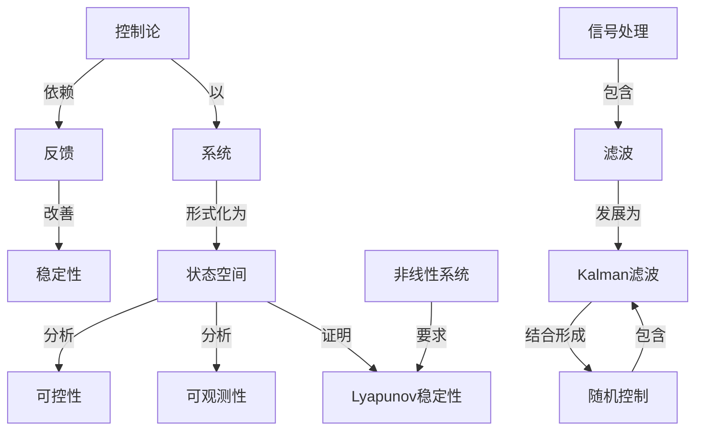

# 控制论引论

**PDF**：`C:\Users\AJ\Documents\Codex\2026-05-28\https-github-com-yangjin2021-think-model-2\[控制论].[控制论引论].pdf`  
**全文 OCR**：[[03-ocr-fulltext-OCR全文/13-控制论引论]]  
**重点概念**：[[05-concept-cards-概念卡片/系统]]、[[05-concept-cards-概念卡片/状态空间]]、[[05-concept-cards-概念卡片/线性系统]]、[[05-concept-cards-概念卡片/稳定性]]、[[05-concept-cards-概念卡片/控制论]]、[[05-concept-cards-概念卡片/非线性系统]]、[[05-concept-cards-概念卡片/信号处理]]、[[05-concept-cards-概念卡片/可控性]]、[[05-concept-cards-概念卡片/随机控制]]、[[05-concept-cards-概念卡片/Kalman滤波]]、[[05-concept-cards-概念卡片/反馈]]、[[05-concept-cards-概念卡片/最优控制]]、[[05-concept-cards-概念卡片/滤波]]、[[05-concept-cards-概念卡片/可观测性]]、[[05-concept-cards-概念卡片/自适应控制]]、[[05-concept-cards-概念卡片/Lyapunov稳定性]]

## 本书定位

建立控制论入门框架，连接反馈、信息、稳定和系统应用。

## 整理大纲

1. 控制论产生
2. 反馈和调节
3. 信息与噪声
4. 机器/生物/社会控制
5. 方法边界

## OCR 识别到的目录/章节线索

- 1994. 8
- 1.控…，.控制论N.0231
- 第一章控制系统概纶
- 第二章反控制理论
- 第三章录优控制理论
- 第五章系…
- 第六章随机系统.…
- 31.3
- 第一章控制系统概论
- 二.系统的指写
- (1. 1)
- 一.力学系统的状态方程
- (2. 3)
- (2. 4)
- (2. 5)
- 二.控制事统的状态方报
- (2. 6)
- 1.1）-（2.3）.街十方程构酸购方科用式（260可写或时盘表
- (2. 8)
- (2. 10)
- 12. 9)
- 三.属性控制系统的成态方程
- (2. 11)
- (2. 12)
- 一.炬降的件买
- (3. 1)
- (3..3)
- 二.矩阵的运算
- 1.短的相加和相减对网个（m×n）起4=Ca28=
- (3.5)
- (3. 4)
- 2.矩降和标量的乘积把柜用4的F有心累都增加。分可
- (3.6)
- (8).4 = a(M)
- (3.7)
- (3.8)
- (3.9)
- 3.是海和题阵的录积（mXn）期阵4和（eX/）定阵a的乘
- (3. 19)
- (3. 11)
- (3. 13)
- 4.矩算的微新分把班阵，冠等的多与班阵的积对标量来效
- 5.姬降的身块用儿型板线和模线率分割矩降4放分到出
- 三.行列式和进矩障
- 1.行到式（x×=)死阵A的行用式可可成
- (3. 26)
- 2.子列式和金因子想阶行列式1A第：行和第列达
- (3.22)
- (3. $3)
- (3.34)
- 3.押随矩阵和进矩阵若短阵8%的元素著余国子A
- (3. 30)
- (3. 31)
- (3. 32)
- (3.33)
- 4.C是相网维数的非奇是矩阵时有
- (3. 35)
- (3. 37)
- (3. 38)
- 四.矩异的特征值和特征方程
- (3. 49)
- 五.二次型
- (5. 441
- 13. 45)
- 1.转移矩降前面衡出，对于任意始定的时刻：对应者个
- 一、种移知阵的一般量法
- (4. 4)
- (4.5)
- (4. 6)
- (4.8)
- (4. 11)
- (4. 13)
- (4.14)
- (4.15)
- (4. 16)
- 2.含强航项线性状志方程的一般解状当转移短片+（)
- (4. 17)
- (4.18)
- 二.定常系统的转够矩阵
- (4. 22)

## 重要理论与工具

- 反馈调节
- 信息传递
- 黑箱
- 学习
- 系统方法

## 重点概念频次

- [[05-concept-cards-概念卡片/系统]]：399
- [[05-concept-cards-概念卡片/状态空间]]：205
- [[05-concept-cards-概念卡片/线性系统]]：163
- [[05-concept-cards-概念卡片/稳定性]]：68
- [[05-concept-cards-概念卡片/控制论]]：63
- [[05-concept-cards-概念卡片/非线性系统]]：49
- [[05-concept-cards-概念卡片/信号处理]]：25
- [[05-concept-cards-概念卡片/可控性]]：18
- [[05-concept-cards-概念卡片/随机控制]]：18
- [[05-concept-cards-概念卡片/Kalman滤波]]：12
- [[05-concept-cards-概念卡片/反馈]]：11
- [[05-concept-cards-概念卡片/最优控制]]：10
- [[05-concept-cards-概念卡片/滤波]]：7
- [[05-concept-cards-概念卡片/可观测性]]：5
- [[05-concept-cards-概念卡片/自适应控制]]：5
- [[05-concept-cards-概念卡片/Lyapunov稳定性]]：4
- [[05-concept-cards-概念卡片/采样定理]]：3
- [[05-concept-cards-概念卡片/传递函数]]：2
- [[05-concept-cards-概念卡片/动态规划]]：2
- [[05-concept-cards-概念卡片/信道容量]]：1

## 理论关系链接

- [[05-concept-cards-概念卡片/控制论]] --以--> [[05-concept-cards-概念卡片/系统]]
- [[05-concept-cards-概念卡片/控制论]] --依赖--> [[05-concept-cards-概念卡片/反馈]]
- [[05-concept-cards-概念卡片/反馈]] --改善--> [[05-concept-cards-概念卡片/稳定性]]
- [[05-concept-cards-概念卡片/信号处理]] --包含--> [[05-concept-cards-概念卡片/滤波]]
- [[05-concept-cards-概念卡片/滤波]] --发展为--> [[05-concept-cards-概念卡片/Kalman滤波]]
- [[05-concept-cards-概念卡片/系统]] --形式化为--> [[05-concept-cards-概念卡片/状态空间]]
- [[05-concept-cards-概念卡片/状态空间]] --分析--> [[05-concept-cards-概念卡片/可控性]]
- [[05-concept-cards-概念卡片/状态空间]] --分析--> [[05-concept-cards-概念卡片/可观测性]]
- [[05-concept-cards-概念卡片/状态空间]] --证明--> [[05-concept-cards-概念卡片/Lyapunov稳定性]]
- [[05-concept-cards-概念卡片/非线性系统]] --要求--> [[05-concept-cards-概念卡片/Lyapunov稳定性]]
- [[05-concept-cards-概念卡片/Kalman滤波]] --结合形成--> [[05-concept-cards-概念卡片/随机控制]]
- [[05-concept-cards-概念卡片/随机控制]] --包含--> [[05-concept-cards-概念卡片/Kalman滤波]]

## OCR 证据摘录

### [[05-concept-cards-概念卡片/系统]]
> 第一章控制系统概纶
> 51或性系统的过麦响应··
> 线作区续控新系统的是定性判强
### [[05-concept-cards-概念卡片/状态空间]]
> 4优状态调节器·…
> 本章霍重介指铺述控制系提的数学方进，以建立状态方程出
> 的族立变量称为状态变量
### [[05-concept-cards-概念卡片/线性系统]]
> 非线性系挑：高费系批步提机6元,书中造务量基星论物理建之体
> 第否章非线性系统
> 5？本线性环节的推述函数
### [[05-concept-cards-概念卡片/稳定性]]
> 中的上衡是不稳定的并且于任何睡
> （3）比后的过论表明，由护稳定指价委求，电定的以使点况.其
> 56线性反馈控制系统的稳定性判据
### [[05-concept-cards-概念卡片/控制论]]
> 控制论引论/卢志恒著·-北京：北京师范大学出版社，
> 1.控…，.控制论N.0231
> 第一章控制系统概纶
### [[05-concept-cards-概念卡片/非线性系统]]
> 非线性系挑：高费系批步提机6元,书中造务量基星论物理建之体
> 第否章非线性系统
> 51非线性物理过程的一般特栏
### [[05-concept-cards-概念卡片/信号处理]]
> 飞船，我学现、社会寻有作控制系统一方国E班受腔制信号，如
> （a）借导线用青头表示信号的速方间，在管头战的下方
> 号面不取出能量，所品信号量开不减少，
### [[05-concept-cards-概念卡片/可控性]]
> 系晓我态方程等一般辉法作了要究最治讨论了系就的可控别位
> 59状态的可控制性和可观测性
> 就民出了乐统状态路我可观图的可控新的向题，
### [[05-concept-cards-概念卡片/随机控制]]
> 第六章随机系统.…
> 51随机过程的基本概名
> 1随机过程的基本概念
### [[05-concept-cards-概念卡片/Kalman滤波]]
> 到最优控影。卡尔曼把准纳的工作推火更版的情形、首先它的
> 随机作不的限于平始就机注程。由干卡尔曼读我的中心所题是通
> 一、卡尔曼滤流的握法
