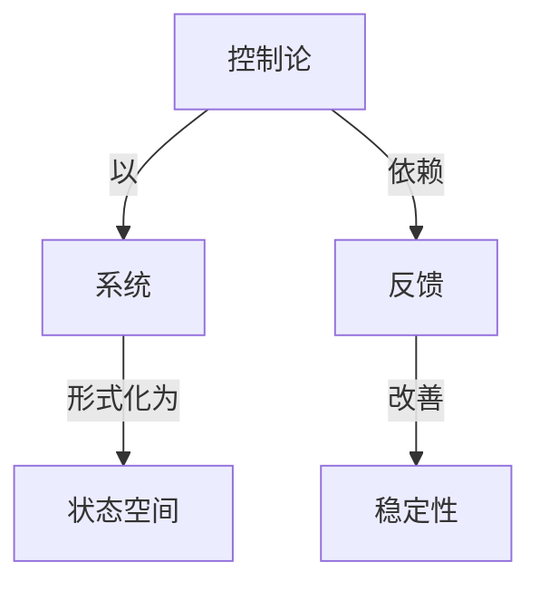

# 控制论浅述

**PDF**：`C:\Users\AJ\Documents\Codex\2026-05-28\https-github-com-yangjin2021-think-model-2\[控制论].[控制论浅述].pdf`  
**全文 OCR**：[[03-ocr-fulltext-OCR全文/14-控制论浅述]]  
**重点概念**：[[05-concept-cards-概念卡片/反馈]]、[[05-concept-cards-概念卡片/状态空间]]、[[05-concept-cards-概念卡片/系统]]、[[05-concept-cards-概念卡片/控制论]]、[[05-concept-cards-概念卡片/信号处理]]、[[05-concept-cards-概念卡片/自适应控制]]、[[05-concept-cards-概念卡片/稳定性]]

## 本书定位

以通俗方式概括控制论基本思想及工程、生物、社会应用。

## 整理大纲

1. 控制论是什么
2. 反馈和信息
3. 自动控制案例
4. 生物调节
5. 社会管理

## OCR 识别到的目录/章节线索

- 3.f2
- 1.0长式K25批
- 1.1
- 1.2
- 1.3
- 1.4
- 1.5
- 1.8
- 1.9
- 1.103/8
- 第二章基本企（）
- 1.11 年图2的款
- 2.1
- 2.6
- 2.7
- 3.8
- 3.10 NB6
- 2.9
- 2.119限
- 2.12根入.最出和输还
- 第三章超制验的学新内容与方让
- 2.18MA的
- 3.0称学与元科学
- 3.1我事.
- 8.2
- 8.3
- 8.4
- 8.5
- 8.Y
- 4.0
- 4.1
- 4.2
- 4.3
- 4.4
- 第五章
- 5.0
- 5.1
- 5.5
- 5.6
- 5.7
- 5.8
- 5.91
- 5.11 人员的分作
- 5.11 R长器 ·
- 5.12
- 第六章健号与表题、号与
- 6.0
- 5.2
- 6.4
- 6.8
- 6.9营.式82X-式
- 6.11版式g.型生.通化
- 7.0 引
- 7.1
- 7.2
- 7.4
- 7.6
- 7.T
- 7.9I
- 7.1 A3985
- 7.11 转2
- 6.1 生*如作@
- 8.2R8
- 8.3 2H世物资目
- 8.4中央开通
- 1.0相对孤立系载
- 1.1时周序列.状态序列、时-面数
- 1.2判津与瓦应
- 1.3四种毛就英型
- 1.4进向可肤
- 1.6X丘时间
- 1.7国内可套系
- 1.9决定起和次决定面款
- 1.10对锅性
- 2.1图解方法
- 2.29-1°采院
- 3.合取系就的票电器，其构证与选单高能的理电器相类配.唯一的
- 8. 1,G 1,G-2,G $, G.3A4, M-2,ML3,S- 4),
- 2.3复不
- 2.3.0

## 重要理论与工具

- 反馈
- 偏差校正
- 信息
- 目标行为
- 系统观点

## 重点概念频次

- [[05-concept-cards-概念卡片/状态空间]]：61
- [[05-concept-cards-概念卡片/系统]]：37
- [[05-concept-cards-概念卡片/控制论]]：7
- [[05-concept-cards-概念卡片/信号处理]]：6
- [[05-concept-cards-概念卡片/自适应控制]]：3
- [[05-concept-cards-概念卡片/稳定性]]：1

## 理论关系链接

- [[05-concept-cards-概念卡片/控制论]] --以--> [[05-concept-cards-概念卡片/系统]]
- [[05-concept-cards-概念卡片/控制论]] --依赖--> [[05-concept-cards-概念卡片/反馈]]
- [[05-concept-cards-概念卡片/反馈]] --改善--> [[05-concept-cards-概念卡片/稳定性]]
- [[05-concept-cards-概念卡片/系统]] --形式化为--> [[05-concept-cards-概念卡片/状态空间]]

## OCR 证据摘录

### [[05-concept-cards-概念卡片/状态空间]]
> 1.1时周序列.状态序列、时-面数
> ，就是各个可解积态的状态序列
> 向，*月”过种状事，加为钢总的过去状态（物您的特动）质光业
### [[05-concept-cards-概念卡片/系统]]
> 这个系统其有如下两个特性。
> 在始定的前向系统中，一个验出的“决定面数”、是指从利限求
> 否米，把某一定对象看你是一个相对孤立系统的信金，往往正
### [[05-concept-cards-概念卡片/控制论]]
> 的不能调节的执份工其的核型.和算节时5.1.0的系晚比腔，这个
> 凡的调节的或受器8。这种辑型（见图5.3.0）包据下月反键别
> 显载和湿远载是扩大受器作用的可调节工具的好国子。
### [[05-concept-cards-概念卡片/信号处理]]
> 信号与表述、符号与路营
> 8.2信号和将号
> 我行以后将用元期信号“这个名间，来称呼账然只包含一个
### [[05-concept-cards-概念卡片/自适应控制]]
> （1）适应性：即一个有机体根持其匠就的内部不面（成称班
> 应性，西儿，不担在模型中续文了适应性，在原型中（即动物体和
> （1）关于适应性，在概登中，运别负反续为法已我了运
### [[05-concept-cards-概念卡片/稳定性]]
> 在对为提上此明的1，只有在这稳定系晓为合辑企时学有可能
