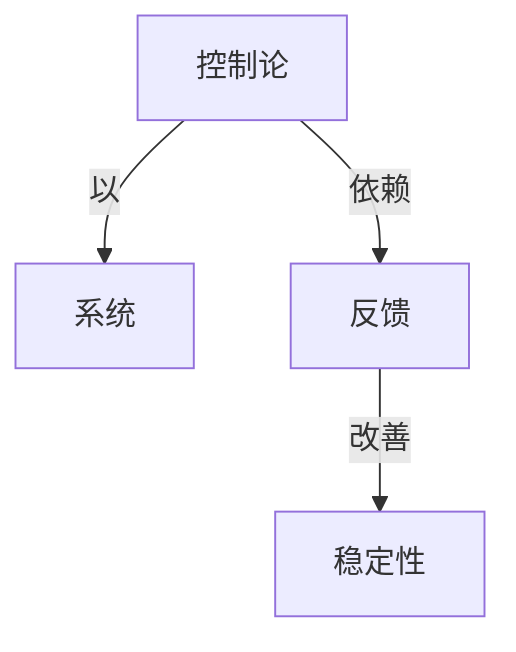

# 智能模拟

**PDF**：`C:\Users\AJ\Documents\Codex\2026-05-28\https-github-com-yangjin2021-think-model-2\[控制论].[智能模拟].pdf`  
**全文 OCR**：[[03-ocr-fulltext-OCR全文/16-智能模拟]]  
**重点概念**：[[05-concept-cards-概念卡片/稳定性]]、[[05-concept-cards-概念卡片/反馈]]、[[05-concept-cards-概念卡片/控制论]]、[[05-concept-cards-概念卡片/系统]]

## 本书定位

用控制论、自动机、搜索和学习模型模拟智能行为。

## 整理大纲

1. 智能和模拟
2. 感知识别
3. 学习模型
4. 搜索和启发式
5. 认知与控制应用

## OCR 识别到的目录/章节线索

- 目录
- 1.2/5 9 E·..
- 1.5.19 有中9
- 1.5.31*年别
- 1.5.1对E导晚用
- 1.2.11 可R
- 1.2.1 8作
- 1.41 s-β排成8
- 5.14 & 式
- 4.1.1 (5 (88) 2次
- 4.1泰式文
- 4.2.2成式27与
- 1.2乘合论的品本相
- 8. 我-年(1883.
- 8.1.1 (0-1,*,3) - [4,-,1,0)
- 1.24
- 0.0
- 1.2.7 39
- (1.1D
- 1.2.日W卡H
- (1.20
- 1.1.1 对与
- 88. 87KgT 1A=T WT, BR+
- 1.1图论的基本额念
- 1.3.1
- 8. *七* T 582的Tmy1 另中用小 (8 159R),
- 13.1 8ES
- 1.1760BBRT+集提1,12(0R
- 2.1我系空间零证
- 2.L
- 1.4]
- 1.4L
- 1.1
- 2.2题门的
- 14.10N排8B
- 1.4,141+9882
- 2.5非商定积序
- 2.5.1 0型间法
- 2.5.1 与-此法
- 第二章习
- 十、*下FERe
- 3.1单题旗并
- 8.1.1
- 8.1 881
- 1.1联的可形性
- (2.)
- (1.1)
- 8.1.4
- 8.2一阶请年
- 1. B6P分 +、 1 3 -
- 12.1E风R
- 11.1 8 # 9
- 8.S, 9 94~Q8AR8ZD,
- 第三章习
- 三. + C+PsTVB(0 8iD=PAoVR(ai iNE CFk D
- 4.1第论方
- 4.1,1样8配
- 4.1的护量决证分退
- (4.0
- 6. 与+R R区A, N
- 4.式
- 6.8-
- 86. 4, 5)*(4 AQ
- 三、品年一二类（的。）行需品，或为
- 第五章智机器人
- 5.2神经元与记名
- 十.**准
- 5.3几器觉
- 21.1 54983481
- 41.81
- (1.8
- 1. 28
- 03.20
- 11.20
- 5.7费推（类比）
- 8.6 (/0)
- 4. Ree E,B "eefiie leeltemr* , ACADEMIC Po, sm,
- 9.6-
- 0.8-

## 重要理论与工具

- 自动机
- 模式识别
- 启发式搜索
- 学习系统
- 状态空间搜索

## 重点概念频次

- [[05-concept-cards-概念卡片/系统]]：1

## 理论关系链接

- [[05-concept-cards-概念卡片/控制论]] --以--> [[05-concept-cards-概念卡片/系统]]
- [[05-concept-cards-概念卡片/控制论]] --依赖--> [[05-concept-cards-概念卡片/反馈]]
- [[05-concept-cards-概念卡片/反馈]] --改善--> [[05-concept-cards-概念卡片/稳定性]]

## OCR 证据摘录

> OCR 证据不足，见全文 OCR。
