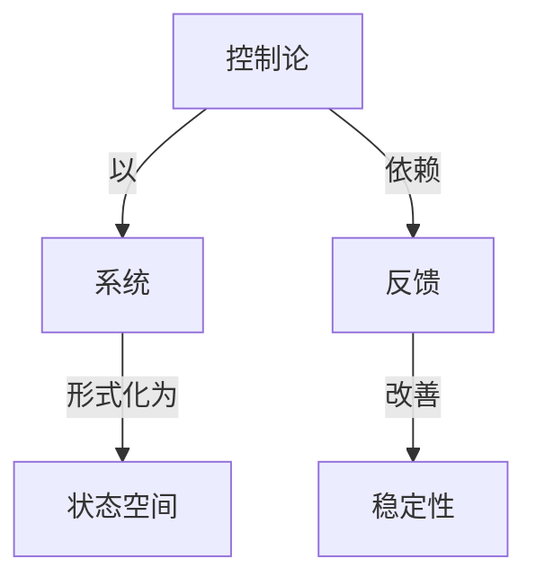

# 最优停止理论

**PDF**：`C:\Users\AJ\Documents\Codex\2026-05-28\https-github-com-yangjin2021-think-model-2\[控制论].[最优停止理论].pdf`  
**全文 OCR**：[[03-ocr-fulltext-OCR全文/17-最优停止理论]]  
**重点概念**：[[05-concept-cards-概念卡片/稳定性]]、[[05-concept-cards-概念卡片/反馈]]、[[05-concept-cards-概念卡片/控制论]]、[[05-concept-cards-概念卡片/最优停止]]、[[05-concept-cards-概念卡片/线性系统]]、[[05-concept-cards-概念卡片/系统]]、[[05-concept-cards-概念卡片/信道容量]]、[[05-concept-cards-概念卡片/采样定理]]、[[05-concept-cards-概念卡片/状态空间]]

## 本书定位

研究何时停止观察或等待，使期望收益最大或损失最小。

## 整理大纲

1. 停止问题建模
2. 离散递推
3. 阈值策略
4. 连续时间模型
5. 典型应用

## OCR 识别到的目录/章节线索

- 51.71
- 序言
- 目录
- 第一章准务知讯
- 1.事件代款
- 2.M机变量
- 4. -BTRN
- 6. 本性上换累.
- 7.立文禁与级大定律
- 第二章W引应用
- 1.允又，例子，收他定理
- 2.收做定理的应用
- 3.时定文年基车镇.
- 6.时的用
- 7.用于水贷期率比检价
- 1.用起的规述与例
- 3.有期情形，监退的情法
- 3. 个8用 ***
- 5.单形
- 6. 5
- 1.定文引.……
- 3、应用：
- 6.广叉停止党量，二定
- 4. ()(RRNE
- 6.A为XR
- 7.对A/的最化上.
- 8. F<∞ Bx[m) <2]<∞
- 8. 对单论的一个应用
- 1. rk光又呼区水尼
- 2. Maroov 9Bt/j.
- 4. G. zSviAg RIB
- 6. 立情形用
- 5. 报企情步
- 1.奔
- 5. s→RE
- 1., .±2**
- 1.事件代数
- (1.1)
- (1.2)
- (1.8)
- 2.机安量
- 3.概准与期望
- (1.4)
- (1.6)
- (1.7)著=>0, 则 B>0,
- (1.8) 81=1,
- (1.9）若品a春在，财对任何实数,（）也存在，
- (1.10)若 Fa, 和 Ba 存在, Sn,+品a不处 +00 0e 的事
- 4.一致可积性
- (1.II)
- (1.18)
- 5.条件期望
- 8.它对导个4∈9
- (1.14)者 >0, N 8(a|9)>0,
- (1.16)
- (1.1T)看为9-且2(n)存在,期
- (1.19）条件题管的单调农造定理若41+R届存在，则
- (1.20）条特期的Fatou睡若e<e(no0)且
- (1.21）最件期望的拉制收放定理著|<a（n>1），
- 6.本性上确界
- 7.独立随机变量与强大数定律
- (1.38)
- (1.58)
- (1.28) 成立, 于是→0, 由 Beo-Oate3i 引厘(见 2.4
- 第二章
- 1.定文，例子，收款定理
- (2.1)
- (3.3)
- (2.8) eP(x(4)>6) ≤
- (2.8)的河个效逐明了当e→∞o时,对=放通P(（a)
- (2.4)
- 6. 8-4
- (2.8)
- 1.8w(6).
- 2.联收故定理的应用
- 2.1, =2m B(=|）比1率1 存在,R
- (2.6) [=B(r()= (AE-1, 2, ).
- 3.体时-定义与基水性质
- (2.9)
- (2.11)

## 重要理论与工具

- 最优停止
- Bellman 方程
- Snell 包络
- 秘书问题
- 鞅方法

## 重点概念频次

- [[05-concept-cards-概念卡片/最优停止]]：8
- [[05-concept-cards-概念卡片/线性系统]]：2
- [[05-concept-cards-概念卡片/系统]]：1
- [[05-concept-cards-概念卡片/信道容量]]：1
- [[05-concept-cards-概念卡片/采样定理]]：1
- [[05-concept-cards-概念卡片/状态空间]]：1

## 理论关系链接

- [[05-concept-cards-概念卡片/控制论]] --以--> [[05-concept-cards-概念卡片/系统]]
- [[05-concept-cards-概念卡片/控制论]] --依赖--> [[05-concept-cards-概念卡片/反馈]]
- [[05-concept-cards-概念卡片/反馈]] --改善--> [[05-concept-cards-概念卡片/稳定性]]
- [[05-concept-cards-概念卡片/系统]] --形式化为--> [[05-concept-cards-概念卡片/状态空间]]

## OCR 证据摘录

### [[05-concept-cards-概念卡片/最优停止]]
> 我子他的能局在赌了=局后停止时的净收益，
> 现在我们费从事新究最优停止网题了，开姓免死式地款
> 7.对/n的最优停止
### [[05-concept-cards-概念卡片/线性系统]]
> 有区月组成的类，则（s非为（线性）Beal最的e代数
> <F(=)}.因为F()通一表线性强数的Inf,所它是四的
### [[05-concept-cards-概念卡片/系统]]
> 的系统云决定知时停止建海对赌业会有什公影响，一个教现
### [[05-concept-cards-概念卡片/信道容量]]
> 费用是个单位，个乎其次年程手（0，0现定了样本容量
### [[05-concept-cards-概念卡片/采样定理]]
> 从力中抽样，我们就要尽快带业，面只要看来是f一我们
### [[05-concept-cards-概念卡片/状态空间]]
> Mazov惊形，停止的决策只放膜于系优我在的状态，可过
