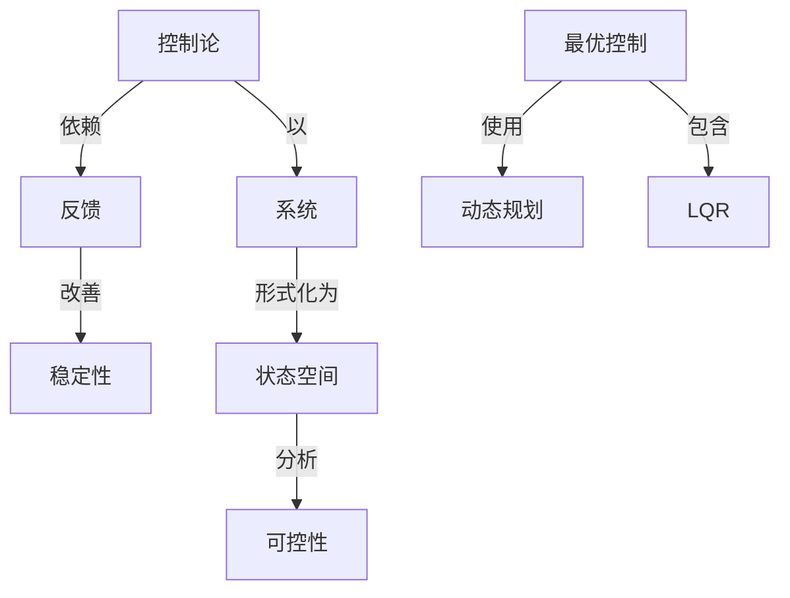

# 最优控制理论

**PDF**：`C:\Users\AJ\Documents\Codex\2026-05-28\https-github-com-yangjin2021-think-model-2\[控制论].[最优控制理论].pdf`  
**全文 OCR**：[[03-ocr-fulltext-OCR全文/18-最优控制理论]]  
**重点概念**：[[05-concept-cards-概念卡片/稳定性]]、[[05-concept-cards-概念卡片/线性系统]]、[[05-concept-cards-概念卡片/状态空间]]、[[05-concept-cards-概念卡片/系统]]、[[05-concept-cards-概念卡片/最优控制]]、[[05-concept-cards-概念卡片/LQR]]、[[05-concept-cards-概念卡片/可控性]]、[[05-concept-cards-概念卡片/控制论]]、[[05-concept-cards-概念卡片/反馈]]、[[05-concept-cards-概念卡片/动态规划]]

## 本书定位

研究动态系统在约束下如何选择控制，使性能指标达到最优。

## 整理大纲

1. 状态方程和目标泛函
2. 变分法
3. 极大值原理
4. 动态规划
5. 线性二次型

## OCR 识别到的目录/章节线索

- 目录
- 2. eP+润E
- 8. g9买E…
- 4. 力导
- 8. 电代工
- 6. 进线风
- 第二章经制问题的表达形式
- 1. 引
- 3.董学价表达形式
- 4.等费的表达形式
- 2.最优性封的不在和不确一
- 4.-0在尼理
- 5.在致老约康的情况下的一个存在定
- 6.非B
- 7.定型4.1的i证用
- 8. 没有 Cmr性质存变定
- 9. 银小化序对中控期的性代
- 9.龙厦T1价证界
- 3.性
- 3. 长他时.
- 4.付理:控征
- 6.或于状志变最为线性的系统
- 5. 选量
- 第五章大值原理及其茶应用
- 1.列
- 5.与支分注的关乐
- 6.奖于此态变量分性的不代
- 7. 线性系用
- 9.线线二次/99风
- 第六章最大值原理的证明
- 1. 3 .
- 2.Fr税值血线
- 3. 线的必安
- 4.捷的优
- 5. 麦分凸是
- 6.9高理
- 7.分离可的解析拍
- 8. 8V.3.1N V.3.2的证界
- 参考文献
- 第一章控制问题的实例
- 1.引套
- 2.生产计划问题
- (2.1)
- (2.2)
- (3.8)
- (32.4)
- (2.5)
- 3.化学工程
- (8.3)
- 8.使其属是（3.2），网时使得%，）取最大值
- 4.飞行力学
- (4.3)
- (4.2)
- (4.8)
- (4.4)
- (4.5)
- (4.6)
- 5.电机工程
- (5.3)
- (5.8)
- 6.捷线问题
- (6.1)
- (6.5)
- (8.8)
- 第二章控制问题的表达形式
- 1.引盲
- 2.控制问题的初等表达形式
- (3.3)
- 第一章所有的树7都是登选得个腔的数，使得第一纪
- (2.2)的题6, 候持/(6, )≤/(本, =)对别有的=∈8年之
- 1.4节的是少然料网题中,/(,)=P(B,),其中P(6,∞)用
- 3.数学的表达形式
- 第2节中的方（2.2）的解邮样来通新，
- (3.1)
- (3.1)的解对的定的和始条件其有唯一性
- 4.等价的表达形式
- (3.1)用
- (4.7)
- 二.细是初始和费止验品是分开给定的，则出我增点条行的特球
- (4.9)

## 重要理论与工具

- 最优控制
- 极大值原理
- Hamiltonian
- 动态规划
- LQR

## 重点概念频次

- [[05-concept-cards-概念卡片/线性系统]]：72
- [[05-concept-cards-概念卡片/状态空间]]：67
- [[05-concept-cards-概念卡片/系统]]：61
- [[05-concept-cards-概念卡片/最优控制]]：19
- [[05-concept-cards-概念卡片/LQR]]：5
- [[05-concept-cards-概念卡片/可控性]]：4
- [[05-concept-cards-概念卡片/控制论]]：1
- [[05-concept-cards-概念卡片/反馈]]：1
- [[05-concept-cards-概念卡片/动态规划]]：1

## 理论关系链接

- [[05-concept-cards-概念卡片/控制论]] --以--> [[05-concept-cards-概念卡片/系统]]
- [[05-concept-cards-概念卡片/控制论]] --依赖--> [[05-concept-cards-概念卡片/反馈]]
- [[05-concept-cards-概念卡片/反馈]] --改善--> [[05-concept-cards-概念卡片/稳定性]]
- [[05-concept-cards-概念卡片/系统]] --形式化为--> [[05-concept-cards-概念卡片/状态空间]]
- [[05-concept-cards-概念卡片/状态空间]] --分析--> [[05-concept-cards-概念卡片/可控性]]
- [[05-concept-cards-概念卡片/最优控制]] --使用--> [[05-concept-cards-概念卡片/动态规划]]
- [[05-concept-cards-概念卡片/最优控制]] --包含--> [[05-concept-cards-概念卡片/LQR]]

## OCR 证据摘录

### [[05-concept-cards-概念卡片/线性系统]]
> 6.或于状志变最为线性的系统
> 的基些性美（活年线性性，通续性，凸性等等性近）可能会改变，医
> 首先，我们考患函数/关于=和：是线性的网题，园此
### [[05-concept-cards-概念卡片/状态空间]]
> 前一享的所有例子每具有如下形式，系扰在时则的状态用
> 更一般核，我们可以要求始时刻4和机始状态4构成的点
> 我求位著面数u）要系度风时刻4的树始状态转移到时期
### [[05-concept-cards-概念卡片/系统]]
> 6.或于状志变最为线性的系统
> 组成的系统，在时对14时这个系统由文源和预喷封的循出
> 房此，很如严是作附在这个系统的每单位质量上的合成外力，我
### [[05-concept-cards-概念卡片/最优控制]]
> 节才导出最优控制的数学网题回模确面又一般的表达旅式，第4
> 定文一个如下的代价世面或性能指标
> 我们费移导出比优仅是可男要表后服可以实成的最优控制
### [[05-concept-cards-概念卡片/LQR]]
> 9.线性二次准则问题
> 是否面数的线性二次判题，设控制约束案是凸的，不借助于
> 本节是出的线性二次准期间题，其中7加（9.11），9如
### [[05-concept-cards-概念卡片/可控性]]
> 新面引到所希塑的位置，只有电动机中的电枢电板·是可控的
> 容济对的存在性月题是与可控性有关的同题，此等分内容不
> (4.7) , (4.6)可控得, 6,在其定文域上类(4, %, 8)为连酵通数 由
### [[05-concept-cards-概念卡片/控制论]]
> 量到到指定的终止位量.期一章第5节的调节得间题就是
### [[05-concept-cards-概念卡片/反馈]]
> 且是连续的，用元方然我行质首光特到作为反馈控制培我的一些
### [[05-concept-cards-概念卡片/动态规划]]
> 2.最大值原理的动态规划很导
