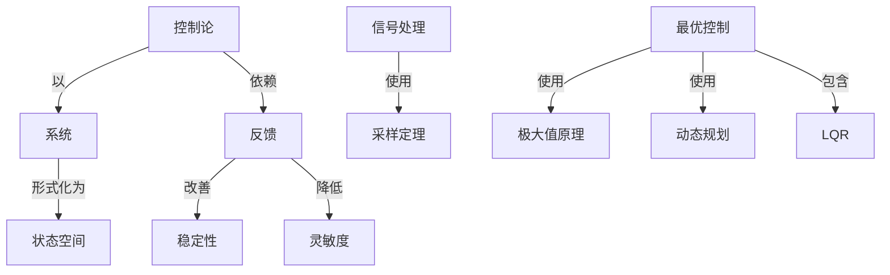

# 最优控制理论与应用

**PDF**：`C:\Users\AJ\Documents\Codex\2026-05-28\https-github-com-yangjin2021-think-model-2\[控制论].[最优控制理论与应用].pdf`  
**全文 OCR**：[[03-ocr-fulltext-OCR全文/19-最优控制理论与应用]]  
**重点概念**：[[05-concept-cards-概念卡片/线性系统]]、[[05-concept-cards-概念卡片/系统]]、[[05-concept-cards-概念卡片/状态空间]]、[[05-concept-cards-概念卡片/最优控制]]、[[05-concept-cards-概念卡片/控制论]]、[[05-concept-cards-概念卡片/稳定性]]、[[05-concept-cards-概念卡片/非线性系统]]、[[05-concept-cards-概念卡片/反馈]]、[[05-concept-cards-概念卡片/采样定理]]、[[05-concept-cards-概念卡片/动态规划]]、[[05-concept-cards-概念卡片/LQR]]、[[05-concept-cards-概念卡片/信号处理]]、[[05-concept-cards-概念卡片/灵敏度]]、[[05-concept-cards-概念卡片/极大值原理]]、[[05-concept-cards-概念卡片/观测器]]、[[05-concept-cards-概念卡片/信道容量]]

## 本书定位

把最优控制理论、算法和工程应用连接起来。

## 整理大纲

1. 问题建模
2. 极大值原理
3. 动态规划
4. 数值求解
5. 工程应用

## OCR 识别到的目录/章节线索

- 前言
- 2584.12.于提毕园
- 0.1
- 0.2
- 0.3
- 1.1
- 1.2
- 1.3
- 1.4
- 1.7
- 1.6
- 1.8
- 2.2
- 2.3
- 2.5
- 2.6
- 4.7
- 第三章租大值系理
- 3.3
- 3.4
- 3.5
- 9.........
- 4.1
- 4.含
- 4. 4
- 68.........
- 4.6
- 5.1多目决蒙题
- 5.2
- 5.3
- 第六章线性二次型最优调节器
- 9.......
- 8.2
- 6.3
- 6.4
- 5.5
- 6.6
- 参考文献
- 第七章
- 7.1
- 7.4
- 7.5
- 7.6
- 7.8
- 8.4
- 8.5
- 8.6
- 9.1
- 9.2
- 9.3
- 18....447
- 9.4设举供飞代病运的的代控……4
- 第十章准最优控制·…
- 10.1线性系统准跌优控制
- 10.3
- 19.3
- 19.5录化指动反境
- 11.1
- 11.2
- 11.3
- 11.4
- 12.2
- 12.4.一种折一号通数
- 12.3
- 12.5高款第卡是方社的计算方法
- 附录线性系统理论的部分结论
- 绪论
- 0.1最优控制问题举例
- (0.1.1)
- (0.1.3)
- (0.1.5)
- (9.1-6)
- (9.1.8)
- (0.1.9)
- (0.1.11)
- (6.1.12)
- (0.1.13)
- (0.1.14)
- (0.1.15)
- 0.2向题的提决

## 重要理论与工具

- 极大值原理
- 动态规划
- LQR
- 射击法
- 直接法

## 重点概念频次

- [[05-concept-cards-概念卡片/线性系统]]：387
- [[05-concept-cards-概念卡片/系统]]：360
- [[05-concept-cards-概念卡片/状态空间]]：359
- [[05-concept-cards-概念卡片/最优控制]]：161
- [[05-concept-cards-概念卡片/控制论]]：112
- [[05-concept-cards-概念卡片/稳定性]]：73
- [[05-concept-cards-概念卡片/非线性系统]]：24
- [[05-concept-cards-概念卡片/反馈]]：19
- [[05-concept-cards-概念卡片/采样定理]]：16
- [[05-concept-cards-概念卡片/动态规划]]：14
- [[05-concept-cards-概念卡片/LQR]]：14
- [[05-concept-cards-概念卡片/信号处理]]：7
- [[05-concept-cards-概念卡片/灵敏度]]：7
- [[05-concept-cards-概念卡片/极大值原理]]：5
- [[05-concept-cards-概念卡片/观测器]]：4
- [[05-concept-cards-概念卡片/信道容量]]：3
- [[05-concept-cards-概念卡片/最优设计]]：3
- [[05-concept-cards-概念卡片/可控性]]：2
- [[05-concept-cards-概念卡片/Riccati方程]]：2
- [[05-concept-cards-概念卡片/可观测性]]：1

## 理论关系链接

- [[05-concept-cards-概念卡片/控制论]] --以--> [[05-concept-cards-概念卡片/系统]]
- [[05-concept-cards-概念卡片/控制论]] --依赖--> [[05-concept-cards-概念卡片/反馈]]
- [[05-concept-cards-概念卡片/反馈]] --改善--> [[05-concept-cards-概念卡片/稳定性]]
- [[05-concept-cards-概念卡片/信号处理]] --使用--> [[05-concept-cards-概念卡片/采样定理]]
- [[05-concept-cards-概念卡片/系统]] --形式化为--> [[05-concept-cards-概念卡片/状态空间]]
- [[05-concept-cards-概念卡片/最优控制]] --使用--> [[05-concept-cards-概念卡片/极大值原理]]
- [[05-concept-cards-概念卡片/最优控制]] --使用--> [[05-concept-cards-概念卡片/动态规划]]
- [[05-concept-cards-概念卡片/最优控制]] --包含--> [[05-concept-cards-概念卡片/LQR]]
- [[05-concept-cards-概念卡片/反馈]] --降低--> [[05-concept-cards-概念卡片/灵敏度]]

## OCR 证据摘录

### [[05-concept-cards-概念卡片/线性系统]]
> 划；线性二次题录优调节器的分析、综会，加收阵选择，灵敏溪分析，
> 线性时不空乐说的对间优具节器.··.…
> 线性有教系统。二次型性能量标的经优控制-…-31
### [[05-concept-cards-概念卡片/系统]]
> 非等给定点调节器，PI调节器，最优跟路；离及采祥系统的最优控
> 一第因章介终一种常见的时间。然料最此控制系统，并留此说
> 程款值解站，内容新额：食企法者已有作论物系统理论的一
### [[05-concept-cards-概念卡片/状态空间]]
> 此质状态受的来问题
> 状态间节额月题小些与补克
> 状态立用对成信不统的影明
### [[05-concept-cards-概念卡片/最优控制]]
> 本书以介绍确定性最优控制理论、用及数值计算为主，其中包
> 间，燃科最优控制；敬态规划，Hami1ton-Jaoobi 方程，微分动苏规
> 第六章线性二次型最优调节器
### [[05-concept-cards-概念卡片/控制论]]
> 划；线性二次题录优调节器的分析、综会，加收阵选择，灵敏溪分析，
> 非等给定点调节器，PI调节器，最优跟路；离及采祥系统的最优控
> 一第因章介终一种常见的时间。然料最此控制系统，并留此说
### [[05-concept-cards-概念卡片/稳定性]]
> 登持服复款，以我以片用。品算决有握系院稳定性为业套目
> 民内的响所，又考家事统的稳定性。
> 医买统就一定是渐址稳定的。即
### [[05-concept-cards-概念卡片/非线性系统]]
> 总面有之，真放要大类原理产生一非线性发分方程的可点边
> 产生一非线性操分方在的两点达值月题，它的解是使租应连续时
> 图4.6中有两个非线性元件N和R。从期论上使,上图册
### [[05-concept-cards-概念卡片/反馈]]
> 这量一种驶反管的闭环控款系成。
> 是有顾的，此种统性反馈正统慕是时变的，基互状态方程加性睫
> 的唯一正定解阵。闭环不统
### [[05-concept-cards-概念卡片/采样定理]]
> 采样频优间节器进行了现入的分时论，是省中另=个重点内齐
> 第九章离散和采样系统的线
> 9.2采样系统的最优他制（4)
### [[05-concept-cards-概念卡片/动态规划]]
> 5.2最优性原理与递注方程
> 上述逐旅关系式是动态规划的基本结是，它基贝尔提质述
> 反设不成立，最优性原理导证。
