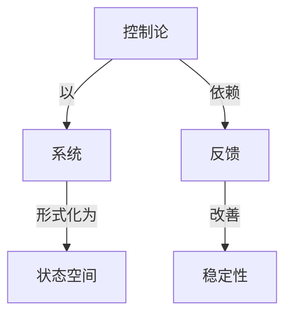

# 最优控制理论基础

**PDF**：`C:\Users\AJ\Documents\Codex\2026-05-28\https-github-com-yangjin2021-think-model-2\[控制论].[最优控制理论基础].pdf`  
**全文 OCR**：[[03-ocr-fulltext-OCR全文/20-最优控制理论基础]]  
**重点概念**：[[05-concept-cards-概念卡片/稳定性]]、[[05-concept-cards-概念卡片/反馈]]、[[05-concept-cards-概念卡片/控制论]]、[[05-concept-cards-概念卡片/线性系统]]、[[05-concept-cards-概念卡片/系统]]、[[05-concept-cards-概念卡片/状态空间]]、[[05-concept-cards-概念卡片/非线性系统]]、[[05-concept-cards-概念卡片/最优控制]]

## 本书定位

提供最优控制入门所需的变分法、极大值原理和动态规划基础。

## 整理大纲

1. 动态系统
2. 性能指标
3. 变分基础
4. 极大值原理
5. 动态规划

## OCR 识别到的目录/章节线索

- 51.931
- 目录
- 第三章
- 4.1
- 4.4
- 5.3定题，的证明
- 5.5填性好提分方程的部
- 第六章
- 6.1广文国的变分与出的受控方租的变分
- 第一章时间最优问题与最大值原理
- 1.1最优问题的提法
- (1.1)
- (1.2)
- (1.3)
- 1.2带参数的典则方程组与宽特里维金最大值条件
- (1.40)
- (1.5)
- 1.3废特里雅金量大值原理
- (1.7)
- (1.8)
- (1.9)
- (1.10)
- (1.11)
- 1.11）中已拉面定，质以n+1个数值步数￥44是自由的，由于
- 1.4最大值条件的几何解释
- 1.5自治情形的最大值原理
- (1.12)
- (1.13)
- 1.6开集U的情形，量优控制问题解的典则表述
- (1.17)
- (1.18)
- 1.7本意结语
- 第二章广文控制
- 2.1广文控制与一个凸制间题
- (2.2)
- (2.3)
- (2.4)
- (2.8)
- 2.2广义控制的弱收款
- (2.7)
- (2.9)
- (2.10)
- 2.2没（0）,1-1.2，,是到S放∈的广文控
- (2.12)
- 第三章逼近引理
- 3.1单位分解
- 2.m8x
- 3.2通近引理
- 0.-,o2
- (3.1)
- (3.2)
- (3.4)
- (3.5)
- (3.6)
- (3.7)
- 第四章微分方程解的存在性
- 4.2买单的推论，在4.4与4.5节中数遗并证明定理4.3与定题
- 4.4.从空42与出定期4.与4.4的方法是真型的积含用的，
- 4.2证明中妥用到的压响晚就不项内定观。
- 4.1预备知识
- (4.2)
- (4.4)
- 4.2压缩映射的不动点定理
- 2.他得对任意的∈V有
- 4.3方程（4.3）解的存在性与迹续依额性定理
- 2.一）每在（4,5）上理续区膜于e，且9充分大时，'（x（-)=）
- (4.7)
- 4.5一般情形分方程解的存在性与连续依最性定理
- (4.80
- (4.9)
- (4.10)
- (4.11)
- 第五章微分方程解的变分公式
- 5.1空间，与B（G）
- 5.2变分方程与解的变分公式
- (5.2)
- (5.6)
- (5.T)
- (6.6
- 1.t称为胖x（r)时复分式.如果只有初使变助ox，而4F（t,x)=0,则

## 重要理论与工具

- Euler-Lagrange 方程
- 极大值原理
- 横截条件
- Bellman 原理
- 时间最优

## 重点概念频次

- [[05-concept-cards-概念卡片/线性系统]]：28
- [[05-concept-cards-概念卡片/系统]]：5
- [[05-concept-cards-概念卡片/状态空间]]：2
- [[05-concept-cards-概念卡片/非线性系统]]：2
- [[05-concept-cards-概念卡片/最优控制]]：2

## 理论关系链接

- [[05-concept-cards-概念卡片/控制论]] --以--> [[05-concept-cards-概念卡片/系统]]
- [[05-concept-cards-概念卡片/控制论]] --依赖--> [[05-concept-cards-概念卡片/反馈]]
- [[05-concept-cards-概念卡片/反馈]] --改善--> [[05-concept-cards-概念卡片/稳定性]]
- [[05-concept-cards-概念卡片/系统]] --形式化为--> [[05-concept-cards-概念卡片/状态空间]]

## OCR 证据摘录

### [[05-concept-cards-概念卡片/线性系统]]
> 理，进而得到了相当广泛的一类由常微分方程所确定的非线性
> 由于关于是线性的，些病是
> 只要注意到，函致早头于是线性的，面致M（t，x，）天→是
### [[05-concept-cards-概念卡片/系统]]
> 系统最优解的存在性条件。
> 改系统的Hamen品款.除了变量x和+划外，函数目证含有时间+及
> 是该系统的一个解，则下式成立，
### [[05-concept-cards-概念卡片/状态空间]]
> 的*状态”可用相成×提述，它的相执述被选定的允作控键￥∈：所
> 状态的线，达种方热有一数性质他其成为究控制阿题的一个重要的
### [[05-concept-cards-概念卡片/非线性系统]]
> 理，进而得到了相当广泛的一类由常微分方程所确定的非线性
> （r∈[,4）的分方6，达一有程是始4（)的非线性方程(5.3)
### [[05-concept-cards-概念卡片/最优控制]]
> 最优控制理论基础
> 后，反映最优控制理论进展的重要著作，作者在书中以自已独
