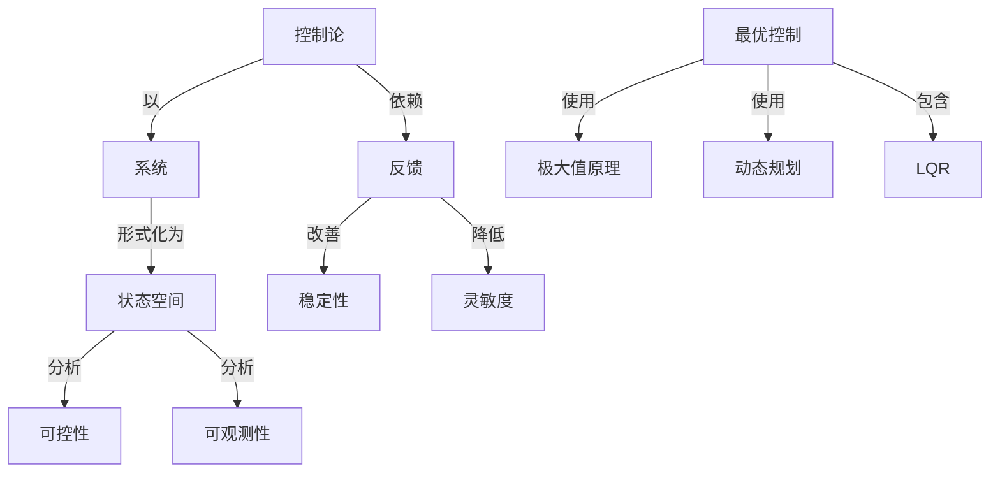

# 最优系统控制

**PDF**：`C:\Users\AJ\Documents\Codex\2026-05-28\https-github-com-yangjin2021-think-model-2\[控制论].[最优系统控制].pdf`  
**全文 OCR**：[[03-ocr-fulltext-OCR全文/24-最优系统控制]]  
**重点概念**：[[05-concept-cards-概念卡片/系统]]、[[05-concept-cards-概念卡片/线性系统]]、[[05-concept-cards-概念卡片/状态空间]]、[[05-concept-cards-概念卡片/可控性]]、[[05-concept-cards-概念卡片/稳定性]]、[[05-concept-cards-概念卡片/最优控制]]、[[05-concept-cards-概念卡片/控制论]]、[[05-concept-cards-概念卡片/非线性系统]]、[[05-concept-cards-概念卡片/灵敏度]]、[[05-concept-cards-概念卡片/Kalman滤波]]、[[05-concept-cards-概念卡片/LQR]]、[[05-concept-cards-概念卡片/反馈]]、[[05-concept-cards-概念卡片/采样定理]]、[[05-concept-cards-概念卡片/动态规划]]、[[05-concept-cards-概念卡片/极大值原理]]、[[05-concept-cards-概念卡片/可观测性]]

## 本书定位

把系统理论、最优控制、估计和随机控制综合起来。

## 整理大纲

1. 状态空间和指标
2. LQR
3. 估计和滤波
4. 随机最优控制
5. 系统综合

## OCR 识别到的目录/章节线索

- 8、9歌介部最优钻计与随机录优控制同题：第19章分期最优控
- 1.共有确定性输入的最优控别（第2、3、4、5、6章）；
- 2.系统前一些强伞，包握可控性，可现测性、风敏度及稳比
- 3.态估计和估计与控制的合（第8、2章》：
- 4.系统控制的计算方（第10章）。
- 目录
- 第1章
- 第3章
- 3.1
- 第4章
- 4.4具有不等式的重的车家儿向品
- 1.4高以（和）量不成月量次要
- 5.18
- 5.1
- 5.4高数的量优控和数学医时
- 第7章
- 1.1线性动态系捷的可我期性
- 7.2换性系现的可控性·…·
- 7.3逾优志流控制的灵单理
- 1.4-1小民理的性
- 6.1最近头有机着入配的联态空民正治客小生方
- 5.3-1时的二次向
- 9.5有计与控制会的票出的元柜查分
- 10.1
- 4.1-4
- 8.33 电我性
- 46.7
- 第1章概远
- 2.了解相应于这个间标的我在的试态
- 3.了解对过出、现在与将家有影利的各个环增远素：
- 4.按且标的定义（1)、我时我态的年识（2)有环境（3）。
- 1.控制问题地定一个承优，已如家就的状态和输入松期间
- 3.机控期月路如图1.3账示：尚题1和间题2相合就
- 4.参量他计间题在许多系规中，系挑的参数可以作为环境
- 5.自通应控制尚题所1州4结合加来就形成自适应控制
- 第3章变分法和连核级公：2制
- 第5章级优系桃控别导间
- 1.级考时间间明：
- 2.线性调节器网题：
- 3.何湿机裁
- 4.级少然科向
- 5.录少期量问时：
- 7.分有参数同题，
- 第7章本快的一些情念
- 第10章最优系说控别的计其方法
- 第2章极值的计算及单级确定过程
- 2.1无约束的板值
- 2.1-1额值价请明
- (2.1-1)
- (2.21)
- ( 2.22 )
- ( 2.23 )
- ( 2.24 )
- (2.25)
- ( 2.2#)
- (2.2-7 )
- 2.下每阵
- 2.3非线性规划
- 11.1.单@2
- 4. MvsokdaRes,_GL, Nmliwer Pywsniy. MeCnss-Hil Beok Ce,
- 5. Dorns, Ga., Lawer Pupemriy end Dtirmiee. Pinetes Usiresiy
- 1. Caeox, M.D, Cusus, C.D, Jh, se Piax, E, Tleey af Cyimai Cooel
- 4.(1RG 305-27,
- 2.x是两维内量，计论考异间题*
- 2.对于一继量生，x其中1~x，面
- 2.03
- 1.95
- 4.假说表在文有一新加的录测值
- 5.如果
- 7.8
- 9.董号式（1.2-1）最党叫内量的所不网的表不式，证明过两
- 第3章变分法和连续最优控制
- 3.1无的束条件的动态最优化
- ( 3.11 )
- ( 3.1-9 )
- (3.1-10 )
- 3.2横截条件
- ( 1.22 )
- 3.3（）极值的充分条件
- ( 3.3-1)

## 重要理论与工具

- LQR
- LQG
- Riccati 方程
- Kalman 滤波
- 分离原则

## 重点概念频次

- [[05-concept-cards-概念卡片/系统]]：337
- [[05-concept-cards-概念卡片/线性系统]]：278
- [[05-concept-cards-概念卡片/状态空间]]：178
- [[05-concept-cards-概念卡片/可控性]]：62
- [[05-concept-cards-概念卡片/稳定性]]：59
- [[05-concept-cards-概念卡片/最优控制]]：45
- [[05-concept-cards-概念卡片/控制论]]：23
- [[05-concept-cards-概念卡片/非线性系统]]：23
- [[05-concept-cards-概念卡片/灵敏度]]：20
- [[05-concept-cards-概念卡片/Kalman滤波]]：11
- [[05-concept-cards-概念卡片/LQR]]：8
- [[05-concept-cards-概念卡片/反馈]]：7
- [[05-concept-cards-概念卡片/采样定理]]：7
- [[05-concept-cards-概念卡片/动态规划]]：7
- [[05-concept-cards-概念卡片/极大值原理]]：6
- [[05-concept-cards-概念卡片/可观测性]]：4
- [[05-concept-cards-概念卡片/观测器]]：4
- [[05-concept-cards-概念卡片/随机控制]]：4
- [[05-concept-cards-概念卡片/编码]]：2
- [[05-concept-cards-概念卡片/Riccati方程]]：2

## 理论关系链接

- [[05-concept-cards-概念卡片/控制论]] --以--> [[05-concept-cards-概念卡片/系统]]
- [[05-concept-cards-概念卡片/控制论]] --依赖--> [[05-concept-cards-概念卡片/反馈]]
- [[05-concept-cards-概念卡片/反馈]] --改善--> [[05-concept-cards-概念卡片/稳定性]]
- [[05-concept-cards-概念卡片/系统]] --形式化为--> [[05-concept-cards-概念卡片/状态空间]]
- [[05-concept-cards-概念卡片/状态空间]] --分析--> [[05-concept-cards-概念卡片/可控性]]
- [[05-concept-cards-概念卡片/状态空间]] --分析--> [[05-concept-cards-概念卡片/可观测性]]
- [[05-concept-cards-概念卡片/最优控制]] --使用--> [[05-concept-cards-概念卡片/极大值原理]]
- [[05-concept-cards-概念卡片/最优控制]] --使用--> [[05-concept-cards-概念卡片/动态规划]]
- [[05-concept-cards-概念卡片/最优控制]] --包含--> [[05-concept-cards-概念卡片/LQR]]
- [[05-concept-cards-概念卡片/反馈]] --降低--> [[05-concept-cards-概念卡片/灵敏度]]

## OCR 证据摘录

### [[05-concept-cards-概念卡片/系统]]
> 举介绍系统的可观测性、可控性、稳定性与灵皮的额念，第
> 备易绩，同时外列有不少知吧，面而很子队事自动控新系统议计
> 近儿年来，将最优化理论应用于系统的控制务隐续得别重
### [[05-concept-cards-概念卡片/线性系统]]
> 新的计算方茫（梯度法、二阶交分法、拟线性化法等）。本书是最
> 1.1线性动态系捷的可我期性
> 第章估计积制的合一线性二次型高斯只题
### [[05-concept-cards-概念卡片/状态空间]]
> 一个过程，必级知进这个过程的瓦时状数，账之为状态销计，可时
> 在的特性，称之为系统识别，知道了价置函最，不统的各状态和费
> 1.控制问题地定一个承优，已如家就的状态和输入松期间
### [[05-concept-cards-概念卡片/可控性]]
> 举介绍系统的可观测性、可控性、稳定性与灵皮的额念，第
> 2.系统前一些强伞，包握可控性，可现测性、风敏度及稳比
> 7.2换性系现的可控性·…·
### [[05-concept-cards-概念卡片/稳定性]]
> 举介绍系统的可观测性、可控性、稳定性与灵皮的额念，第
> 会期系规稳定性的员您，骨的送了线性系优稳定性和级优化间的
> 、有两个不方面：系统的稳定性授有证：需要求期的
### [[05-concept-cards-概念卡片/最优控制]]
> 本-性类10章。第2至第6章介细确定性系悦的最优控制网
> 管重介绍最优控制各种方法的基本理论。基本限企，相互关系、
> 较。最后离要讨论了高数时间最优控制和重学现划之间存在的
### [[05-concept-cards-概念卡片/控制论]]
> 2.线性调节器网题：
> 于非平稳建我的有名的卡尔赞-维助算，论述了跳次和调节器
> 常买于控制系统习题的各要变分问取，求强时所要受的大多数基
### [[05-concept-cards-概念卡片/非线性系统]]
> 2.3非线性规划
> 要作用，它在非线性规财看作：4中被评细文。现生研文一个
> 中所说明的。应读注意，在典要的非线性规划问题中，函数4
### [[05-concept-cards-概念卡片/灵敏度]]
> 马时对近路系优提出了价文步数灵敏度间通的名种方法，
> 7.3最优系统控制的灵敏度
> [20的工作，使灵敏度在控制系线中的应用委到他续。在3了中
### [[05-concept-cards-概念卡片/Kalman滤波]]
> 段先取得成果的是卡尔曼和那度整（Narcnde）C1，2。
> 卡东曼您波中的误系，还可能由除系用次优卡尔曼增益以外
> 在上述各式中，K,是次优卡尔曼增业，P是装确声Q,（）的势
