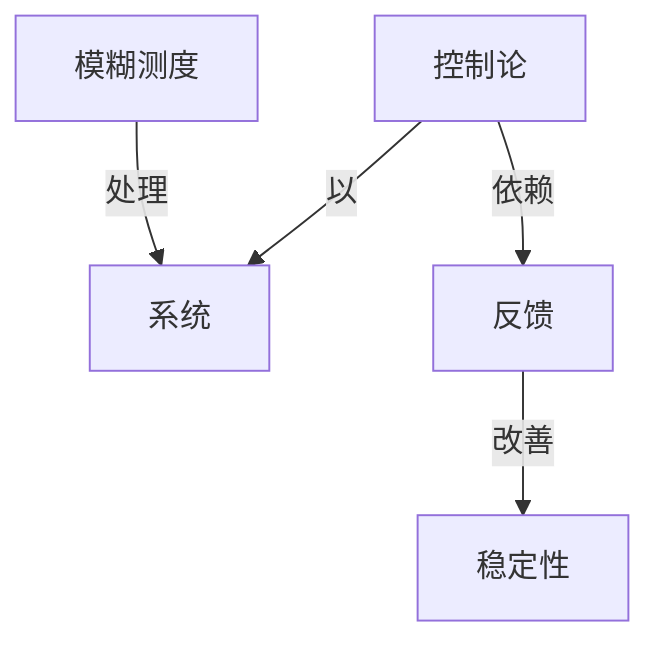

# 模糊值测度论

**PDF**：`C:\Users\AJ\Documents\Codex\2026-05-28\https-github-com-yangjin2021-think-model-2\[控制论].[模糊值测度论].pdf`  
**全文 OCR**：[[03-ocr-fulltext-OCR全文/27-模糊值测度论]]  
**重点概念**：[[05-concept-cards-概念卡片/稳定性]]、[[05-concept-cards-概念卡片/反馈]]、[[05-concept-cards-概念卡片/控制论]]、[[05-concept-cards-概念卡片/模糊测度]]、[[05-concept-cards-概念卡片/系统]]

## 本书定位

研究模糊值集合函数、模糊测度和非概率不确定性。

## 整理大纲

1. 模糊集合
2. 测度论基础
3. 模糊测度
4. 模糊积分
5. 决策应用

## OCR 识别到的目录/章节线索

- 1.1.张I.模期集-测度论N.0159
- 1.3核量集价的境过算
- 2. 1
- 5.4情测的新收理
- 5.2广又模看值测度的隐时建理
- 3. 4
- 1.1
- 19. 1
- 第1章模糊集合
- 1.1模糊集合的定文与运算
- 1.1.2楼限集合的定义
- 0.2%.我认发59岁程80岁是比较年老的.面且80岁比409
- 1 1.2
- 1.13根限集合的运算及其性质
- 1.2模集合的分解定理与表现定理
- 1.2.1模限集合的裁量
- 91.11令
- 1.2.2模根集合的分解定理
- 1.2.3合套及其运算
- 1.3模集合的模运算
- 1、其E
- 第2章模糊数的模糊极限
- 2.1模数的定义及其性质
- 2.1.1硬相集合的扩承原理
- 32.1.412/·X→Y,x=f(x),
- 2.1.1模数的定义及性质
- 1. z=a)
- 2.1.3项期数的序及运算
- (0.1]有
- 36.如果<≤3.且有在A∈(0.1使
- 0.称为相数-
- 9121.4令
- 10. a L
- 9 21.6
- 10、 z 4 [ 1.1]
- 921.1设
- 3. rf《 a (01]
- 2.2模糊数的模期距离
- 4.2
- 2.3模開数的模极限定义及运算
- 1.sp
- 3 3. T R (a,1, (3,1c.9(A)2,B e :(R),2.
- 2.4模糊数的模极限性质
- 9.37 能够报 v = (0,=1,2,",)折&益 -
- 2 4. 5 的 - 如是 A 是-个无穷集分别 A 至少有浆交-
- 第3章模糊值测度的性质及其扩张
- 3.1核集合的可加类
- 3.1 23D7=7,7≠
- 0. 即 7n8≠.
- 1.特到地-A,与A,我有公共点的究要条件是（2,A,(x)=
- 3.1-3 ￥,=(V,)
- 3.2模值测度的定义及其性质
- 2.3入A=12,…,我们可以证明
- 2.4.1我们有
- 2. 1.6和定理2.3.2.对干任例A∈（0,1]，都是裤泉集可3
- 3.3模糊值测度的扩张
- 13.我们记
- 3. 2.2 和命题3. 2. 3,对于任何自性数n,夜们有
- (3.3. 1)
- (3. 3. 2)
- (3. 3. 3)
- 3 3. 12 % μ′ (A)+, (7)=μ(X), 其由定组 2. 1-8 R折有
- 第4章模糊值可测函数
- 4.1模糊值可测函数
- 4.1.1损限集合的代载
- (4. 1)
- 4.1.2横限值可测涵数
- 7.为17.1&上的上确界（分别地，下确界）,记为7.*ep7（分
- 0.于是时于每个a1-2,,开对于每个xX、令
- 4.2几乎处处收敛与依测度收敛
- 2.月称P在A上凡平处处或立
- 7、如果对于任何的c>0,有
- 7.则：7.1在x上你测变=收做于了.
- 12.4
- 6. 2. 5（1)(7,>是强缺提期值别度=基车的.调由定理42-11存在
- 17、1便得它在7上儿手姓处收效于.
- 4.3模值可测函数亏模糊值-函数的关系
- 43.1可测空间上的实值简单-函数
- 1.+ 2r
- (4. 3. 1)

## 重要理论与工具

- 模糊集合
- 模糊测度
- Sugeno 积分
- Choquet 积分
- 可能性测度

## 重点概念频次

- [[05-concept-cards-概念卡片/模糊测度]]：34
- [[05-concept-cards-概念卡片/系统]]：2

## 理论关系链接

- [[05-concept-cards-概念卡片/控制论]] --以--> [[05-concept-cards-概念卡片/系统]]
- [[05-concept-cards-概念卡片/控制论]] --依赖--> [[05-concept-cards-概念卡片/反馈]]
- [[05-concept-cards-概念卡片/反馈]] --改善--> [[05-concept-cards-概念卡片/稳定性]]
- [[05-concept-cards-概念卡片/模糊测度]] --处理--> [[05-concept-cards-概念卡片/系统]]

## OCR 证据摘录

### [[05-concept-cards-概念卡片/模糊测度]]
> 模糊积分性质：第三部分讨论模糊值模糊测度的渐近结构特征、扩张及模糊
> 俏模糊可测函数序列的各种收效性和模糊值模翻积分序列收，最后讨论模
> 值模糊积分定义模糊值模期测度的邀传性。
### [[05-concept-cards-概念卡片/系统]]
> 该书系统地论述了作者近几年来在模数和模翻测度等方面的研究成
> 20张广全，模相管模数积分的一质等价定文.医账系统数学
