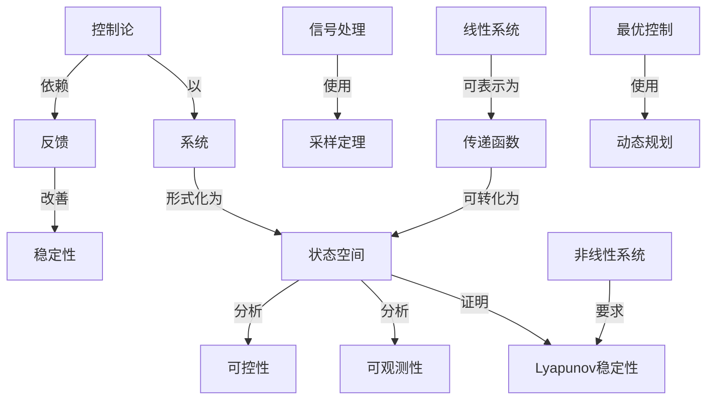

# 状态空间分析导论上、下

**PDF**：`C:\Users\AJ\Documents\Codex\2026-05-28\https-github-com-yangjin2021-think-model-2\[控制论].[状态空间分析导论上、下].pdf`  
**全文 OCR**：[[03-ocr-fulltext-OCR全文/29-状态空间分析导论上-下]]  
**重点概念**：[[05-concept-cards-概念卡片/系统]]、[[05-concept-cards-概念卡片/线性系统]]、[[05-concept-cards-概念卡片/稳定性]]、[[05-concept-cards-概念卡片/状态空间]]、[[05-concept-cards-概念卡片/可控性]]、[[05-concept-cards-概念卡片/采样定理]]、[[05-concept-cards-概念卡片/非线性系统]]、[[05-concept-cards-概念卡片/控制论]]、[[05-concept-cards-概念卡片/Kalman滤波]]、[[05-concept-cards-概念卡片/可观测性]]、[[05-concept-cards-概念卡片/信号处理]]、[[05-concept-cards-概念卡片/Lyapunov稳定性]]、[[05-concept-cards-概念卡片/反馈]]、[[05-concept-cards-概念卡片/传递函数]]、[[05-concept-cards-概念卡片/最优控制]]、[[05-concept-cards-概念卡片/动态规划]]

## 本书定位

系统介绍状态空间建模、稳定性、可控可观和控制综合。

## 整理大纲

1. 状态空间模型
2. 坐标变换
3. Lyapunov 稳定性
4. 可控可观分解
5. 反馈和观测器

## OCR 识别到的目录/章节线索

- 8. 8. 1体
- 8. 1. 8 n
- 序言
- 目录
- 第一章
- 1.3
- 第二章
- 2.2
- 2.1
- 2.3
- 2.4
- 2.9
- 2.18
- 3.1
- 3.2
- 3.3
- 5.4
- 3.5
- 3.6
- 1.1
- 3.11
- 8.11
- 4.1
- 4.2
- 4.3
- 6.5
- 4.6
- 4.7
- 4.8
- 4.5
- 5.1
- 5.2
- 5.4时不交系明
- 8.8始难酒
- 6.2业.·
- 6.3
- 5.8
- 6. 19 8ki
- 第七章
- 7.2
- 7. 6
- 7.11
- 8.1
- 8.2
- 8. 5
- 8. 6
- 8.7
- 9.日
- 9.4定常注续系明
- 9.6软&空网的分解
- 附录罗-尔维幕定性准列
- 第一章预备知识
- 1.1.引官
- 1.2.系统概念
- 1.-1控系就办两个部9
- 1.数学吸型，确定系说的一个运当的数学属达（核型）。
- 2.可控期性.确定是否可能月一个命令或控制借号来影响
- 3.可观润性，从品测定的输出，很如可题的请，要计算装置
- 4.执行指标，要章执行的指标必须定好，达择的面标的钢
- 5.容许检制位号，规成要求必质定好，用来医定容计控制
- 6.控制正然，4，5两项定好以后，编合一个最优控新求提还
- 8.稳定性，闭年
- 1.3.结束语
- 第二章有限维矢量空间
- 2.1.引1官
- 2.2.标量与数城
- 2.3.线性空间的基本概念
- 2.5节中的出，7面的例子对一个热悉的火是立与始出了物理解
- 2.4.推空间
- 2.5.矢量空间的抽象定文
- 2.性齐欧业分方量
- 2.6.线性相关、基底与维数
- 1.2
- 2.7，子空间与超平面
- 1.对L中的%一对x与y其期x+y是在L中。
- 2.对中为部个x及实数人,实量是在L中,
- 2.7-3中有个超平面，它含有x与r的降应，即x与r都
- 2.8.内积空间
- 2.8-1请条件就用作范数，我们将在83.11中时论更一般的
- 2.9.复内积空间

## 重要理论与工具

- 状态空间
- 相似变换
- Lyapunov 方法
- Kalman 分解
- 最小实现

## 重点概念频次

- [[05-concept-cards-概念卡片/系统]]：498
- [[05-concept-cards-概念卡片/线性系统]]：313
- [[05-concept-cards-概念卡片/稳定性]]：197
- [[05-concept-cards-概念卡片/状态空间]]：195
- [[05-concept-cards-概念卡片/可控性]]：104
- [[05-concept-cards-概念卡片/采样定理]]：23
- [[05-concept-cards-概念卡片/非线性系统]]：18
- [[05-concept-cards-概念卡片/控制论]]：11
- [[05-concept-cards-概念卡片/Kalman滤波]]：8
- [[05-concept-cards-概念卡片/可观测性]]：7
- [[05-concept-cards-概念卡片/信号处理]]：6
- [[05-concept-cards-概念卡片/Lyapunov稳定性]]：4
- [[05-concept-cards-概念卡片/反馈]]：2
- [[05-concept-cards-概念卡片/传递函数]]：1
- [[05-concept-cards-概念卡片/最优控制]]：1
- [[05-concept-cards-概念卡片/动态规划]]：1
- [[05-concept-cards-概念卡片/LQR]]：1

## 理论关系链接

- [[05-concept-cards-概念卡片/控制论]] --以--> [[05-concept-cards-概念卡片/系统]]
- [[05-concept-cards-概念卡片/控制论]] --依赖--> [[05-concept-cards-概念卡片/反馈]]
- [[05-concept-cards-概念卡片/反馈]] --改善--> [[05-concept-cards-概念卡片/稳定性]]
- [[05-concept-cards-概念卡片/信号处理]] --使用--> [[05-concept-cards-概念卡片/采样定理]]
- [[05-concept-cards-概念卡片/系统]] --形式化为--> [[05-concept-cards-概念卡片/状态空间]]
- [[05-concept-cards-概念卡片/状态空间]] --分析--> [[05-concept-cards-概念卡片/可控性]]
- [[05-concept-cards-概念卡片/状态空间]] --分析--> [[05-concept-cards-概念卡片/可观测性]]
- [[05-concept-cards-概念卡片/状态空间]] --证明--> [[05-concept-cards-概念卡片/Lyapunov稳定性]]
- [[05-concept-cards-概念卡片/线性系统]] --可表示为--> [[05-concept-cards-概念卡片/传递函数]]
- [[05-concept-cards-概念卡片/传递函数]] --可转化为--> [[05-concept-cards-概念卡片/状态空间]]
- [[05-concept-cards-概念卡片/非线性系统]] --要求--> [[05-concept-cards-概念卡片/Lyapunov稳定性]]
- [[05-concept-cards-概念卡片/最优控制]] --使用--> [[05-concept-cards-概念卡片/动态规划]]

## OCR 证据摘录

### [[05-concept-cards-概念卡片/系统]]
> 自资约，换之，我们认为远水数开者可试享基地为系统星论
> 多他人多输日系统
> 1.2.系统概念
### [[05-concept-cards-概念卡片/线性系统]]
> 对线性交同与理泌了能登我广证的论吧。在第二*有
> 念来分新系统营要是银的有限维关量空间或始章线性代数及
> 新找求得到了充分的堂属和了解：丑开多物理系统的动当用线性
### [[05-concept-cards-概念卡片/稳定性]]
> 自治系快的稳定性·-
> 8.稳定性，闭年
> 定，稳定性的考意当然
### [[05-concept-cards-概念卡片/状态空间]]
> 状态空间分析导论
> 状态空间分析导论
> 状态空间分析导论
### [[05-concept-cards-概念卡片/可控性]]
> 2.可控期性.确定是否可能月一个命令或控制借号来影响
> 至的统暖都不加手虑，天于稳定性、可控制性及可现期性请分析
> 第九意可控制性与可观测性
### [[05-concept-cards-概念卡片/采样定理]]
> 时间系院，多李上、我们的开究只涉及到抽样数账系说、类们于
> 如浆系快是对不变的且抽样区润是常数，方登（8）可略加障
> 本保持价描述计算机的抽样，通保持元件提习“平播的”
### [[05-concept-cards-概念卡片/非线性系统]]
> 对初始条件y（4)是线性的，何对验入（1)是非线性的。
> 非线性的微分系统可写作
> 的非线性不统。系统
### [[05-concept-cards-概念卡片/控制论]]
> 个控制系统被认为想含两个基本部分。即放把系统（电称为装置）
> 现在介绍控制系统的念，在腔系优工程师为口证中，一
> 的“组合系”通含之为控制系统
### [[05-concept-cards-概念卡片/Kalman滤波]]
> 方商化形式[Kalman，193]。
> 大时陶省数，丘可用干货计响应的最大时间[Kalman物erta，
> 霍尔维茨不等式确定，它在附录 IV 中给出[Kalman 和Bertren,
### [[05-concept-cards-概念卡片/可观测性]]
> 第九意可控制性与可观测性
> 它的对得是定全可观测的，反之到，例如把对偶方程代入定理
> 定文84-2系统称为可观测的，如果「中没有为学的列
