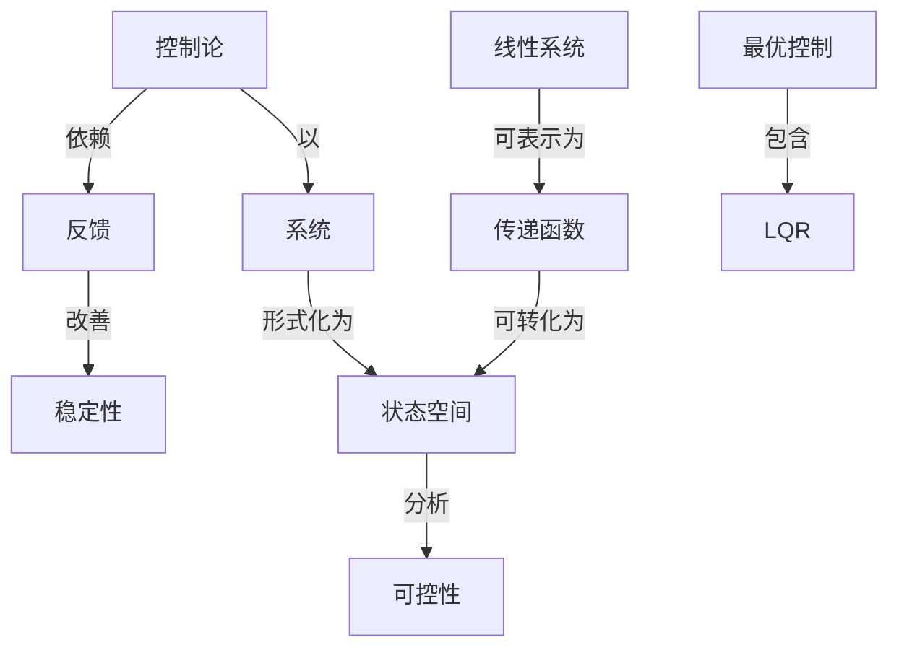

# 现代控制理论基础例题与习题

**PDF**：`C:\Users\AJ\Documents\Codex\2026-05-28\https-github-com-yangjin2021-think-model-2\[控制论].[现代控制理论基础例题与习题].pdf`  
**全文 OCR**：[[03-ocr-fulltext-OCR全文/31-现代控制理论基础例题与习题]]  
**重点概念**：[[05-concept-cards-概念卡片/稳定性]]、[[05-concept-cards-概念卡片/反馈]]、[[05-concept-cards-概念卡片/控制论]]、[[05-concept-cards-概念卡片/系统]]、[[05-concept-cards-概念卡片/可控性]]、[[05-concept-cards-概念卡片/线性系统]]、[[05-concept-cards-概念卡片/状态空间]]、[[05-concept-cards-概念卡片/信号处理]]、[[05-concept-cards-概念卡片/传递函数]]、[[05-concept-cards-概念卡片/最优控制]]、[[05-concept-cards-概念卡片/LQR]]、[[05-concept-cards-概念卡片/质量控制]]

## 本书定位

用例题和习题巩固现代控制中的矩阵判据、稳定性和设计方法。

## 整理大纲

1. 状态空间计算
2. 可控可观题
3. Lyapunov 题
4. 反馈设计题
5. 最优和滤波题

## OCR 识别到的目录/章节线索

- 二.5个
- 2.限成注营;
- (1.IF
- 41.1-40
- 11. 2-81
- 13.2-18)
- (1.5-11a0
- (1.$-18)
- (1.214)
- (1.2(8H)
- (1.2-186
- 1.1-2-40
- (1.3-$4)
- (1.248)
- 1.对带化用条件
- 2.可身化
- (1.3H)
- 3.著E界A是次业E
- (1.3-)
- 1.4.择在为的包非5的多件
- (1.1-181
- (1 4.1)
- 11.44)
- 0. * + 4,
- 第二章较市方程的解与连续时间系统的离散化
- 5.儿
- (2. ≥12)
- 4.+11
- 1.R的ca/c为的
- 2.1-28)
- (2.1-81)
- (2.1-46)
- 2.-
- 1.1440
- (1. 1-38)
- 1.98
- (2.3-B)
- (2.3-F)
- (3.IM8)
- 0. 194484
- 0.319111
- 1.A化E力
- (2.34)
- (2.3-S)
- (2.1-F)
- (1.3-18)
- 5./i
- 11.k
- 1.日图.乐电路
- 第三章系续的可控性，可现到生分析
- 1.4国持轮疗法
- (3.1-)
- 92.14试月期下开系M
- 1.A.时角接化护利用
- (1.3-1)
- (3.26)
- 13. I-6
- (3. 2-13)
- (1.3-10
- 1.块非可到
- (2.$-F)
- (3.3-6)
- (3.1T)
- 3.36
- 1. 4-110
- 13. 6-1E)
- 1.第-可现期电
- 1.+1E
- 3. +)
- (3.+28)
- (3.4-21)
- 三.多星人多国出活标标理的的博点
- 1.老2一（A，8分类全可.间必可通步复T代号价地受为可标维
- (3.+44)
- (3.4-18)
- (1.4-47)
- 9. =Dx_A..
- (3. $-3D
- (5. $880
- (3. 6-M)

## 重要理论与工具

- 可控性判据
- 可观测性判据
- Lyapunov 方程
- Riccati 方程
- 极点配置

## 重点概念频次

- [[05-concept-cards-概念卡片/系统]]：10
- [[05-concept-cards-概念卡片/可控性]]：6
- [[05-concept-cards-概念卡片/线性系统]]：5
- [[05-concept-cards-概念卡片/状态空间]]：2
- [[05-concept-cards-概念卡片/信号处理]]：1
- [[05-concept-cards-概念卡片/传递函数]]：1
- [[05-concept-cards-概念卡片/最优控制]]：1
- [[05-concept-cards-概念卡片/LQR]]：1
- [[05-concept-cards-概念卡片/质量控制]]：1

## 理论关系链接

- [[05-concept-cards-概念卡片/控制论]] --以--> [[05-concept-cards-概念卡片/系统]]
- [[05-concept-cards-概念卡片/控制论]] --依赖--> [[05-concept-cards-概念卡片/反馈]]
- [[05-concept-cards-概念卡片/反馈]] --改善--> [[05-concept-cards-概念卡片/稳定性]]
- [[05-concept-cards-概念卡片/系统]] --形式化为--> [[05-concept-cards-概念卡片/状态空间]]
- [[05-concept-cards-概念卡片/状态空间]] --分析--> [[05-concept-cards-概念卡片/可控性]]
- [[05-concept-cards-概念卡片/线性系统]] --可表示为--> [[05-concept-cards-概念卡片/传递函数]]
- [[05-concept-cards-概念卡片/传递函数]] --可转化为--> [[05-concept-cards-概念卡片/状态空间]]
- [[05-concept-cards-概念卡片/最优控制]] --包含--> [[05-concept-cards-概念卡片/LQR]]

## OCR 证据摘录

### [[05-concept-cards-概念卡片/系统]]
> 本教材对现代控制理论的几个方面：现代控制理论基器、系统分析与设计、最
> 优控制、系统排识等进行丁闸述，全书分12章，每章都有各种典盟例题，通过选例
> 累一章系统状态相型的建立
### [[05-concept-cards-概念卡片/可控性]]
> 第三章系续的可控性，可现到生分析
> 53-1通接系统的可控性
> 可控老都a]=1.可,
### [[05-concept-cards-概念卡片/线性系统]]
> 第器章线性系统的鸭分解与
> 54-1线性系统的球构分新
> 第十章线性二次型问题的最优控制
### [[05-concept-cards-概念卡片/状态空间]]
> 累一章系统状态相型的建立
> 522状态等及状方程片服会式
### [[05-concept-cards-概念卡片/信号处理]]
> -.路机联电平信号步长家电平号
### [[05-concept-cards-概念卡片/传递函数]]
> 传递函数阵的量小实现
### [[05-concept-cards-概念卡片/最优控制]]
> 第十章线性二次型问题的最优控制
