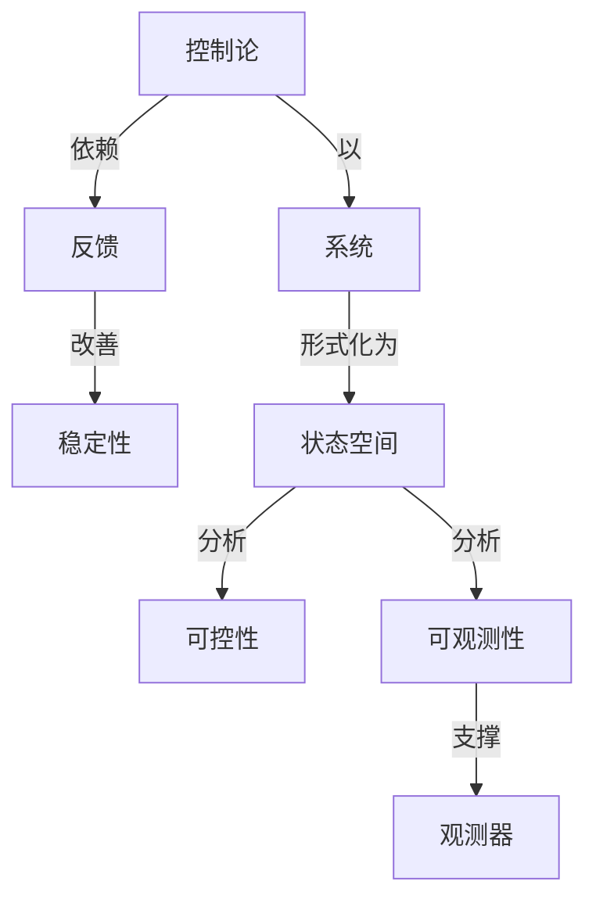

# 线性系统理论

**PDF**：`C:\Users\AJ\Documents\Codex\2026-05-28\https-github-com-yangjin2021-think-model-2\[控制论].[线性系统理论].pdf`  
**全文 OCR**：[[03-ocr-fulltext-OCR全文/33-线性系统理论]]  
**重点概念**：[[05-concept-cards-概念卡片/反馈]]、[[05-concept-cards-概念卡片/控制论]]、[[05-concept-cards-概念卡片/线性系统]]、[[05-concept-cards-概念卡片/系统]]、[[05-concept-cards-概念卡片/可观测性]]、[[05-concept-cards-概念卡片/可控性]]、[[05-concept-cards-概念卡片/稳定性]]、[[05-concept-cards-概念卡片/状态空间]]、[[05-concept-cards-概念卡片/观测器]]

## 本书定位

系统研究线性动态系统的结构性质、实现理论和控制综合。

## 整理大纲

1. 状态空间和输入输出
2. 稳定和谱性质
3. 可控可观
4. 实现理论
5. 反馈和观测器

## OCR 识别到的目录/章节线索

- 395.463
- 39.430444N09
- 25.468·?48
- 39.4n [0on( .4)- 1]
- 88.44(98(4)
- 第八章二次型是
- 1.1 RE步 68:9t
- 0.1制北述
- 0.3本内谷安得
- 第一章数学基础
- 1.2能%代数物个贴果
- (12.1
- (12.3)
- 1.25
- (1.15
- (1.380)
- (12.11)
- 3.410
- 8.411I
- 6.411I
- 0.4[4)
- (1.487)
- 0.490
- (1.521)
- 1.529分W
- (15.8)
- (1.36)
- (1.530)
- (1.313)
- (15.D)
- 08.1, = 2, 4, =9;
- 1.6广文Se方
- 4.6D
- 0.61b
- (1.616)
- 1.96-8
- 11.000
- 9.4=
- 第二章线性系统的数学描述
- 2.1出系的管递后数指店
- (12.)
- (2.1)
- (22.0)
- 0.214)
- (1.20)
- (23.7
- 2.3.K)
- 2.312)
- (23.1)
- (23.H)
- (23.K)
- (2.1.22)
- (3.2)
- (13.)
- 0.338)
- 9.132)
- 2.33ti
- 2.4线型系规的代载等价性
- (2.5.l)
- (21.2)
- 8. (实R7B6. EMA3M
- (11.6
- (5.5
- 2.51)
- 0.590
- 25.R
- 第三章线性系统的运动分析
- 3.1运建分费的多文
- 01.3)
- 0.15)
- 0.58
- 3.2状与转伊斯降及其性质
- 0.27)
- 0.2h
- 0.21)
- 40.-4t) ,A-1,
- 02.0
- 4. 阳
- 0.1.da) *
- (2.11)

## 重要理论与工具

- 线性系统
- Kalman 分解
- 实现理论
- 极点配置
- 传递矩阵

## 重点概念频次

- [[05-concept-cards-概念卡片/线性系统]]：32
- [[05-concept-cards-概念卡片/系统]]：18
- [[05-concept-cards-概念卡片/可观测性]]：4
- [[05-concept-cards-概念卡片/可控性]]：3
- [[05-concept-cards-概念卡片/稳定性]]：2
- [[05-concept-cards-概念卡片/状态空间]]：2
- [[05-concept-cards-概念卡片/观测器]]：2

## 理论关系链接

- [[05-concept-cards-概念卡片/控制论]] --以--> [[05-concept-cards-概念卡片/系统]]
- [[05-concept-cards-概念卡片/控制论]] --依赖--> [[05-concept-cards-概念卡片/反馈]]
- [[05-concept-cards-概念卡片/反馈]] --改善--> [[05-concept-cards-概念卡片/稳定性]]
- [[05-concept-cards-概念卡片/系统]] --形式化为--> [[05-concept-cards-概念卡片/状态空间]]
- [[05-concept-cards-概念卡片/状态空间]] --分析--> [[05-concept-cards-概念卡片/可控性]]
- [[05-concept-cards-概念卡片/状态空间]] --分析--> [[05-concept-cards-概念卡片/可观测性]]
- [[05-concept-cards-概念卡片/可观测性]] --支撑--> [[05-concept-cards-概念卡片/观测器]]

## OCR 证据摘录

### [[05-concept-cards-概念卡片/线性系统]]
> 本书系统地围述以状态空时方法为上的线性系纯的时润成理论，全作共分1
> 析以及稳定性分析;第六春无第1章图述规性系纯的设计限论-分别介细线性系统的能点
> 配管和特征结构配置，镇定渐适跟踪、线性“次型能优会制，解携控制、状态观测器等
### [[05-concept-cards-概念卡片/系统]]
> 本书系统地围述以状态空时方法为上的线性系纯的时润成理论，全作共分1
> 章至彩h章所述线作系继的分析理论，分洲介始线r系统的运动分析，能控性和能观代行
> 析以及稳定性分析;第六春无第1章图述规性系纯的设计限论-分别介细线性系统的能点
### [[05-concept-cards-概念卡片/可观测性]]
> 第四章线性系统的能控性和能观性
> 44对型专能观性用版
> 第四章线性系统的能控性和能观性
### [[05-concept-cards-概念卡片/可控性]]
> 章至彩h章所述线作系继的分析理论，分洲介始线r系统的运动分析，能控性和能观代行
> 第四章线性系统的能控性和能观性
> 第四章线性系统的能控性和能观性
### [[05-concept-cards-概念卡片/稳定性]]
> 析以及稳定性分析;第六春无第1章图述规性系纯的设计限论-分别介细线性系统的能点
### [[05-concept-cards-概念卡片/状态空间]]
> 本书系统地围述以状态空时方法为上的线性系纯的时润成理论，全作共分1
> 配管和特征结构配置，镇定渐适跟踪、线性“次型能优会制，解携控制、状态观测器等
### [[05-concept-cards-概念卡片/观测器]]
> 配管和特征结构配置，镇定渐适跟踪、线性“次型能优会制，解携控制、状态观测器等
