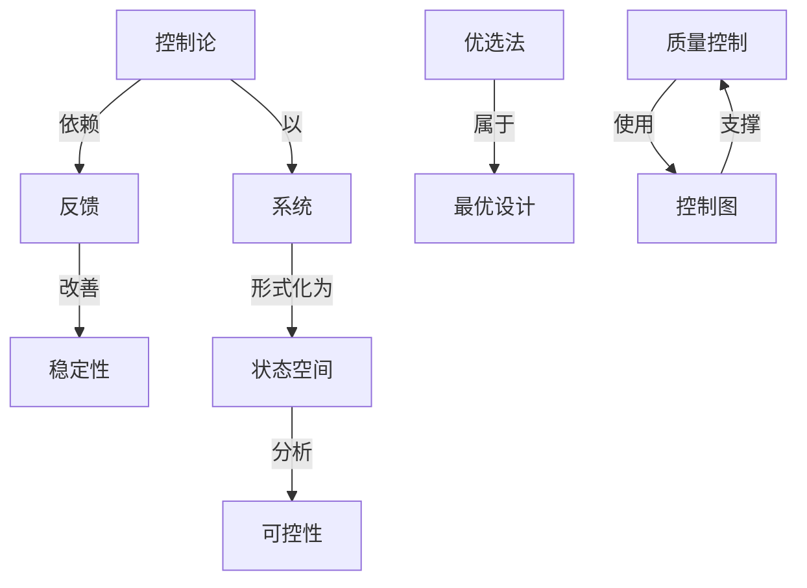

# 质量控制

**PDF**：`C:\Users\AJ\Documents\Codex\2026-05-28\https-github-com-yangjin2021-think-model-2\[控制论].[质量控制].pdf`  
**全文 OCR**：[[03-ocr-fulltext-OCR全文/34-质量控制]]  
**重点概念**：[[05-concept-cards-概念卡片/采样定理]]、[[05-concept-cards-概念卡片/状态空间]]、[[05-concept-cards-概念卡片/控制图]]、[[05-concept-cards-概念卡片/系统]]、[[05-concept-cards-概念卡片/稳定性]]、[[05-concept-cards-概念卡片/质量控制]]、[[05-concept-cards-概念卡片/线性系统]]、[[05-concept-cards-概念卡片/可控性]]、[[05-concept-cards-概念卡片/优选法]]、[[05-concept-cards-概念卡片/最优设计]]、[[05-concept-cards-概念卡片/控制论]]、[[05-concept-cards-概念卡片/反馈]]

## 本书定位

用统计方法监控、保证和改进生产过程质量。

## 整理大纲

1. 质量和变差
2. 抽样检验
3. 控制图
4. 过程能力
5. 质量改进

## OCR 识别到的目录/章节线索

- 第一章重验控的基本知识
- 二、 质T
- 七. 文e±*
- 二. R(18 6.6
- 第二章简易的使计方法
- 二、方国的观包外析
- 第二节排列图
- 第三节园图
- 一、因是续
- 二、 因男插的润基
- 三、 注8事理
- 二、工业力指
- 二、智关系教
- 二、成本式
- 第二节计量值检制征
- 二、中包8-R (2B)-
- 三、节售-涉动很毛控%述(e-A,月)
- 第三节计款值控制图
- 二.·路与r图
- 二、院生至的容分析
- 二、使用控制用的全过程
- 第一节基本账念
- 一、几个度墅的术了
- 1.3F
- 五、计数二次及多次物并方写
- 第二节价数导准型独样方宝
- 二、计数一次的择方定的求法
- 第三节计数调整型控群方案组
- 一、儿个降身的幅念
- 第五章计量抽样检查
- 一、格与不介移品车
- 二、卫本工业排 BZ%94：
- 第三节计笔调型拍样方案限-
- 二、民家标电的实发
- 第六章正交设计与参数设计
- 第一节正交表第介
- 一、 指科因素和(平·
- 二、Z交斯
- 第二节正交设计的基本方续……
- 三、试鲁结登的力到分析
- 第三节参数级计的届本热
- 二、质显我动反于优i
- 三、非数设
- 第五节正交多项到图
- 二、互交多项上美
- 二、 系使8
- 第一章质景控制的基本知识
- 一.在湿际上，历量控封的理论相方法已于成基，它是概率
- 第一节质量与质量特性
- 一、质量
- 二、产品质量特性
- 1. 性R
- 2.寿命
- 3.可器性
- 4.安全性
- 5.楼清性
- 三、真王质量特维与代用质量特性
- 四、质量特征情
- 1.计器值
- 2.计量值
- 第二节美量控制与全面质量管理
- 一、武量控制
- 1.对质量影成全证程的控制
- 2.统针股量酸制
- 1.16g
- 二、全面量管理
- 第三节全面质量管理的基础工作
- 二、十盘工 作
- 三、录信息管理
- 四、质量贵任制
- 五、质量教育
- 1.量室识放育
- 2.全层量管理知识和方法款育
- 3.找求蛙训
- 六、质量管理机构
- 七、文明生产
- 第四节质量诊断
- 一、什么是质量诊斯
- 二、原量诊断的特点
- 三、产品质量诊断

## 重要理论与工具

- 统计过程控制
- Shewhart 控制图
- OC 曲线
- 过程能力指数
- 抽样检验

## 重点概念频次

- [[05-concept-cards-概念卡片/采样定理]]：42
- [[05-concept-cards-概念卡片/状态空间]]：41
- [[05-concept-cards-概念卡片/控制图]]：38
- [[05-concept-cards-概念卡片/系统]]：22
- [[05-concept-cards-概念卡片/稳定性]]：14
- [[05-concept-cards-概念卡片/质量控制]]：14
- [[05-concept-cards-概念卡片/线性系统]]：13
- [[05-concept-cards-概念卡片/可控性]]：11
- [[05-concept-cards-概念卡片/优选法]]：2
- [[05-concept-cards-概念卡片/最优设计]]：2
- [[05-concept-cards-概念卡片/控制论]]：1
- [[05-concept-cards-概念卡片/反馈]]：1

## 理论关系链接

- [[05-concept-cards-概念卡片/控制论]] --以--> [[05-concept-cards-概念卡片/系统]]
- [[05-concept-cards-概念卡片/控制论]] --依赖--> [[05-concept-cards-概念卡片/反馈]]
- [[05-concept-cards-概念卡片/反馈]] --改善--> [[05-concept-cards-概念卡片/稳定性]]
- [[05-concept-cards-概念卡片/系统]] --形式化为--> [[05-concept-cards-概念卡片/状态空间]]
- [[05-concept-cards-概念卡片/状态空间]] --分析--> [[05-concept-cards-概念卡片/可控性]]
- [[05-concept-cards-概念卡片/优选法]] --属于--> [[05-concept-cards-概念卡片/最优设计]]
- [[05-concept-cards-概念卡片/质量控制]] --使用--> [[05-concept-cards-概念卡片/控制图]]
- [[05-concept-cards-概念卡片/控制图]] --支撑--> [[05-concept-cards-概念卡片/质量控制]]

## OCR 证据摘录

### [[05-concept-cards-概念卡片/采样定理]]
> 数、散布图、控制图、计数和计能抽样检查方法、正交设计和参数设计等，这
> 第因章计数抽样检查·
> 第五章计量抽样检查
### [[05-concept-cards-概念卡片/状态空间]]
> 无用，设备仅器探持民好状态，有时还要求时厂原的服度
> 质量的名种因靠是否处于受价状态，所调”受控”缺是要求：
> 誉路，核室正常状态的工学控制方法称之为工序诊新请节
### [[05-concept-cards-概念卡片/控制图]]
> 数、散布图、控制图、计数和计能抽样检查方法、正交设计和参数设计等，这
> 第三节计款值控制图
> 国际标准，包括常用统计方店、控制图和抽导检查等。
### [[05-concept-cards-概念卡片/系统]]
> 过程是指方干程字成耳节的连质整体，何加产品制
> 的质至宜任系统，不少金业在经择责任额中服定了质量责任
> 日标联系成为一个套密的整体，其中望特别重核我最位息的
### [[05-concept-cards-概念卡片/稳定性]]
> b.质董不稳定重复收障多、分狭率任的工序，
> （3）判断工序质量是否处于稳定（控制）状态，稳定状态
> （4）工序不稳定。年：由于材料改麦、机器的操作派度
### [[05-concept-cards-概念卡片/质量控制]]
> 质量控制是-门新兴的管理学科、它对提高产品质量、降低生产成本
> 时质量控制标准：
> 配、数理规计学在工业全业质量括动中的应用，质量控制标
### [[05-concept-cards-概念卡片/线性系统]]
> 线性关系，两变量之间的数布围大象可分下列五种情账，如
> （1）弧正相炎，潜大、也随之线性增大，与y之
> 之线性港大，此对绿了因意·外可能还有其它因素影响”。
### [[05-concept-cards-概念卡片/可控性]]
> 管和控制，称为可控医买，钢如视显度、济捷时间、加强量
> 实需可控因实的正变表称为内表，安操装差器靠的正交
> 在惠新登电额中可控因素为4，B，D,E，P，世硬电用
### [[05-concept-cards-概念卡片/优选法]]
> 3.ay=0.618那.作9第过0.618，体不合
### [[05-concept-cards-概念卡片/最优设计]]
> 创动了就步数设计为获心的产品优化设计方法。
> 定推的指标，进行步我设址，本节口电感电路的优化设计为
