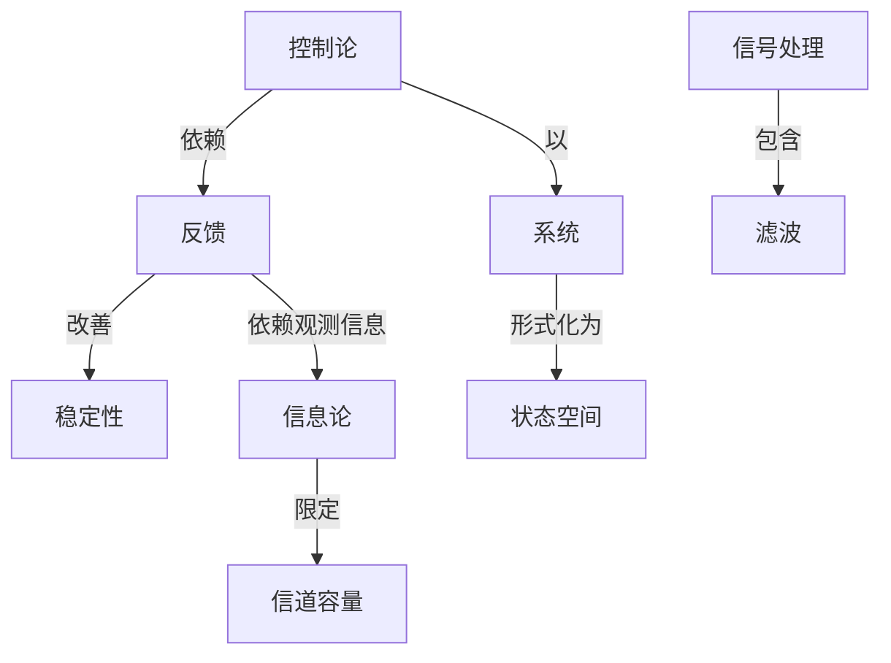

# 具有适应性特色的自动控制系统

**PDF**：`C:\Users\AJ\Documents\Codex\2026-05-28\https-github-com-yangjin2021-think-model-2\[控制论].[具有适应性特色的自动控制系统].pdf`  
**全文 OCR**：[[OCR全文/06-具有适应性特色的自动控制系统]]  
**重点概念**：[[概念/反馈]]、[[概念/控制论]]、[[概念/状态空间]]、[[概念/系统]]、[[概念/稳定性]]、[[概念/信号处理]]、[[概念/信道容量]]、[[概念/滤波]]、[[概念/随机控制]]、[[概念/信息论]]、[[概念/线性系统]]、[[概念/自适应控制]]、[[概念/优选法]]

## 本书定位

研究对象参数和环境变化时，控制器如何在线调整模型或控制律。

## 整理大纲

1. 自适应问题
2. 参数辨识
3. 模型参考自适应
4. 自校正调节
5. 稳定性和鲁棒性

## OCR 识别到的目录/章节线索

- 目录
- 第二章禁电式控科盈获中以各种
- 第五章自行改变款的检制验系肤
- 引言
- 第一章
- 9.即在调节系就自动之明纳定的，授新验的数生对于这共请节
- 2.为借建的动作时；
- 9.4
- 0.6,
- 2.N
- 第二章
- 4.6
- 0.6
- 6.6
- 4.1
- 6.9
- 0.8
- 0.0
- 0.9
- 8.6
- 9.0
- 4.2
- 9.06
- 6.0
- 9.9
- 8.0
- 6.a
- 6.85
- 3.0
- 8.3
- 8.28
- 5.3
- 4.0
- 6.1
- 1.6
- 4.8
- 1.4
- 4.9
- 1.F
- 1.1
- 6.25
- 6.86
- 8.4
- 6.#
- 8.9
- 3.3
- 8.2
- 6.2
- 6.8
- 6.3
- 3.1
- 9.3
- 3.9
- 5.0
- 1.9
- 8.#
- 8.1
- 8.8
- 3.#
- 2.8
- 10.其中使用级化级电器P区与管号单电强P.电压的比轮是两
- 9.1
- 2.1
- 5.#
- 2.4
- 1.#
- 2.2
- 9.8
- 1.fs
- 4.28
- 3.8
- 5.8
- 0.1
- 6.28
- 1.8
- 3.4
- 5.9
- 2.5
- 1.88
- 2.0

## 重要理论与工具

- 自适应控制
- 参数辨识
- 递推最小二乘
- Lyapunov 方法
- 持续激励

## 重点概念频次

- [[概念/控制论]]：142
- [[概念/状态空间]]：110
- [[概念/系统]]：53
- [[概念/稳定性]]：42
- [[概念/信号处理]]：11
- [[概念/信道容量]]：6
- [[概念/滤波]]：3
- [[概念/随机控制]]：2
- [[概念/信息论]]：1
- [[概念/线性系统]]：1
- [[概念/自适应控制]]：1
- [[概念/优选法]]：1

## 理论关系链接

- [[概念/控制论]] --以--> [[概念/系统]]
- [[概念/控制论]] --依赖--> [[概念/反馈]]
- [[概念/反馈]] --改善--> [[概念/稳定性]]
- [[概念/反馈]] --依赖观测信息--> [[概念/信息论]]
- [[概念/信息论]] --限定--> [[概念/信道容量]]
- [[概念/信号处理]] --包含--> [[概念/滤波]]
- [[概念/系统]] --形式化为--> [[概念/状态空间]]

## OCR 证据摘录

### [[概念/控制论]]
> 具有适应性特色的自动控制系统
> 郑十享把起候节霜成是款态润节款量调节的广文
> 一水力通中民箱叶等角的调节多站自马克药科学院电工鲜
### [[概念/状态空间]]
> 提需的状态（指高）下工作，有提制面承硬中，各并控制、产生、变
> 我信把骗是架为状态的或然率是度，手购的我试，香个元彩的
> 种胚柜图和时算死中的触发否一样，只有两种状态：受朝放或不受
### [[概念/系统]]
> 具有适应性特色的自动控制系统
> 本书研究了生产过程的新自动提新系统，这些系的特点是能使其
> 动作以及其他的质盘指标，这些系统的发展与工程控制输的新自动控制
### [[概念/稳定性]]
> 无率业稳定，封这器事持间时发生之程率等于远事件之新
> 十分稳定，起大时间保省领配录的电压，过小的电通不能配录，
> 同路，国此不存在发生自神板面（失去稳定性）的除
### [[概念/信号处理]]
> 出信号的强退分量（将是
> 始对过行一次形开的学习直就够了，总后，婚入信号的对数器
> 比动（信号）期风的租各自行额武不税
### [[概念/信道容量]]
> 记录容量，只有整本书成至整个医中路，其“配亿”容量才风以
> 为了搜容量优式持性，诞是一个作为系款提量指标的录，
> 寸成记亿容量的收变，那就整之为判用“增长第理”的系，在
### [[概念/滤波]]
> 的机品（障后）滤波器、这对候买盗相减到模小的数快"
> 能系就润别蛋岛额率中是够高，品收于能够家实便宜的考带滤波
### [[概念/随机控制]]
> 随机过程的晓叶现验
> 的限生对于随机过程务然保除其会叉
### [[概念/信息论]]
> 信息量与清息的街申之贸的关乐
