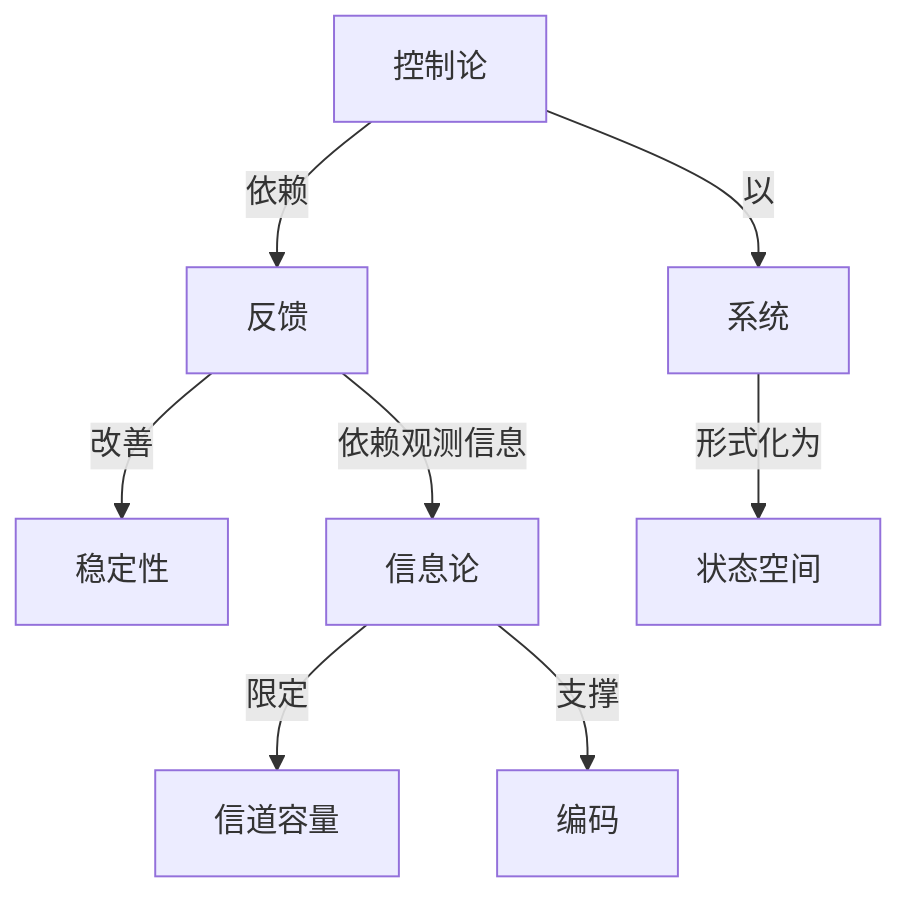

# 控制论的哲学原理数学丛书

**PDF**：`C:\Users\AJ\Documents\Codex\2026-05-28\https-github-com-yangjin2021-think-model-2\[控制论].[控制论的哲学原理数学丛书].pdf`  
**全文 OCR**：[[OCR全文/15-控制论的哲学原理数学丛书]]  
**重点概念**：[[概念/控制论]]、[[概念/系统]]、[[概念/稳定性]]、[[概念/状态空间]]、[[概念/信号处理]]、[[概念/信息论]]、[[概念/编码]]、[[概念/反馈]]、[[概念/信道容量]]、[[概念/线性系统]]

## 本书定位

讨论控制论的哲学基础、循环因果、功能模拟和系统层次。

## 整理大纲

1. 哲学前提
2. 反馈和因果
3. 结构与功能
4. 层次和整体
5. 模型与现实

## OCR 识别到的目录/章节线索

- 目录
- 第一章控制论，它在科学知识体系中的地位和
- 第一节拉制论的严生
- 第三节腔别论各学特的分类
- 第五节控制论系统产生和活动的客现双朝
- 第六节
- 第七节
- 附录
- 序言
- 3.日.哈佳用火以及用自已的意死和建议据助了乎格修改的
- 第一章
- 第一节控制论的产生
- 第二节控制论的对象和客体
- 第三节控制论各学科的分类
- 8.2- %,*B+,RA 3971 年9,8 171 有)
- 5. I28%*2R论HR9 E。
- 第二章
- 第四节控制论中的系统方法
- 8.期/41967 96-897999 Z+7
- 第五节控别论系统产生和活动的客观亚辑
- 8.3706 )
- 第七节控别概念和有机体生命的实质问题
- 第八节“售息概念和售学基本问题
- 28.3814931。
- 第三章
- 第九节意识的信息-调节性质
- 1.C.维东我越之后，宜布意识与外部活动统一的原则、关于
- 第十节模拟意识的方法论问题
- 5.314R
- 6.B.此智科夫：6控论和科学方法论9，英所科1974年
- 第二节拉制论的对象和客体
- 3.纳：控制论和社会.第1章，奖斯科198邮版。
- 第三节控新论各学科的分类
- 第2节，明斯支1969年版。
- 第四节控别论中的系统方法
- 3.A.阿的投始，现代的结构账含3，优（科学知证逐明分
- 4.8.伊林：关于我代生物学发展的特证唯物主又原
- 0.库布斯，款育龙机（票施分析）3，莫期科1970年
- 第五节控制论系统产生和活动的客观证辑
- 0.B.萨奇科大：c新率额城张论2，真斯科1971年题。
- 第六节反地原则和目的抵念
- 1.A.阿赫米多娃：6°人-机等系使中的国果性与民的
- 5.C.乌克网采失，《自农投制系和民录性），英斯科
- 第七节控制账念和有机体生命的实质网题
- 4.11.别尔格，1控别论—关于最世控制的科学3，莫斯
- 8.2.维社达，段济控逾2，明斯克1971年版。
- 10..初尔尼置克，《情息和控制3，莫斯料1976年版。
- 3.付列牌条尔，6什会是生命13，莫斯料1972年版。
- 1. B, 阿都刘比宁斯然：C分联每系统3,列宁族勒 1969年
- 4.X.科尔资通失、B.B.受达托夫：《段胰论和有号的扇
- 3.日.谢拉增，《从业物学家的疯点看佰血论》，列宁格输
- 80.A.安系晋耶火：（学值息的信号2，英斯料1071年
- 1.转里回艾;C科学的不有定性和价基3，莫案科1566年
- 5.皮正、5.9*昆捷尔，C初等男结构的发生实新
- 第十节模报意识的方法论问题
- 2.4.网列克沙中，c控别论加是维3，其新科1971年版。
- 3.M.博特编慧宽，（论等卖控制论的目的0，其案料975
- 1.B.端维克：《心班模拟的行季网题），莫斯科1965年
- 4.Z.别尔济，旺.B退唯克，控制论的方法论问题），我
- 10.B.萨奇科夫，0概率领域横论3，第8章，其斯科1971
- 5.C.乌宽校国采夫，A.工.乌尔苏耳、《控制论和唯物册
- 第一章控别论和它在科学体系申的地位
- 第一节控新论的产生
- 第三节控别论各学科的分类
- 第二章腔制论的基本限念以及它们网四学范
- 第六节瓦销旅到和目的套图
- 第七节招联和调节的概念
- 第八节“信息概念和暂学基本问题
- 第三章控制论和量识问题
- 第九节京识的信息-调节性质
- 第十节核报意识的方法论问题
- 第十一节现代科学的提制论化

## 重要理论与工具

- 循环因果
- 目的性
- 系统哲学
- 功能模拟
- 模型论

## 重点概念频次

- [[概念/控制论]]：506
- [[概念/系统]]：503
- [[概念/稳定性]]：34
- [[概念/状态空间]]：18
- [[概念/信号处理]]：12
- [[概念/信息论]]：10
- [[概念/编码]]：7
- [[概念/反馈]]：4
- [[概念/信道容量]]：3
- [[概念/线性系统]]：2

## 理论关系链接

- [[概念/控制论]] --以--> [[概念/系统]]
- [[概念/控制论]] --依赖--> [[概念/反馈]]
- [[概念/反馈]] --改善--> [[概念/稳定性]]
- [[概念/反馈]] --依赖观测信息--> [[概念/信息论]]
- [[概念/信息论]] --限定--> [[概念/信道容量]]
- [[概念/信息论]] --支撑--> [[概念/编码]]
- [[概念/系统]] --形式化为--> [[概念/状态空间]]

## OCR 证据摘录

### [[概念/控制论]]
> 控制论的哲学原理
> 控制论的哲学原理
> 控制论的哲学原理
### [[概念/系统]]
> 学，数学、计算机、通讯和倍总地，系统工程，百且步及心速学、
> 智学系的专题课的教材。本书对腔别论网题网述比较系统。
> 及与之密初取系的系统-结构方法在舞决者学和自然科季同
### [[概念/稳定性]]
> 分辉性既表现稳定性的要素，又删约看相互作阳，因面也制约
> 观象过程好，这种方然把后者的高靠性和稳定性的因素悠对
> 展的规非性，相条价的周据性重复（在这个意文上是稳定性
### [[概念/状态空间]]
> 看你是“护止的*和孩立的，卖达居维过程的费止状态，并国式
> 城的所有这税至系院、是成部分，都不仅处于祖互染得状态，
> 随君发杂化和气体状态的火去，火然有机物活失列*热的
### [[概念/信号处理]]
> 说，类银的利康物部具布信号的性质。
> 此，给信息以信号的能处设有决定性意文）。
> 息，面在条件联系形成以后，这种别激物获得了信号的性质，
### [[概念/信息论]]
> 普通的（内容本富的）值息论和账学的（卓家的）信息论，是产
> 信息意得含（和数学信息论）同信息权念（网香通信息论）
> 总“等。复视这种奖单化，敬会产生把信息论提真到“科学的
### [[概念/编码]]
> 中（成者它的程序基）完成编码”目的，这个口的可能是根其
> 形式（类假形式的省息），面且有各种符号中编码了的事约家
> 等）。社会贷息可以用各牌不网前方式加以编码和储存，图19
### [[概念/反馈]]
> 第大节反馈原则和目的服念
> 系统的活动始，由于使用反馈原则，被校制客体教有入基一签
> 反馈原购在实现心耀活动中的作用
### [[概念/信道容量]]
> 成在我们再建列导留总（适个容量大和方正多的最您的
> 总之，“佰息”这个提含是容量极其大的和多方面的：这一
> 算员美增年存储约容量和货息处理的建度，不仅在“分限时
### [[概念/线性系统]]
> 上分折被换报观象的香通的款学手段（线性和动都的程序设
> 线性8序t(ANNRBOE IPGPAXMHPOBHHS)
