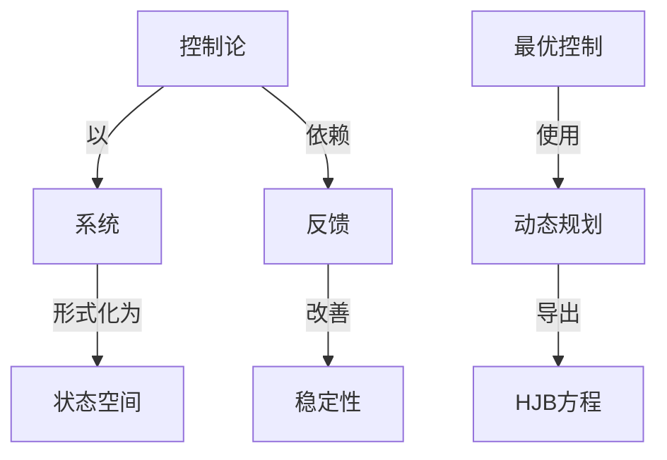

# 最优控制的数学理论

**PDF**：`C:\Users\AJ\Documents\Codex\2026-05-28\https-github-com-yangjin2021-think-model-2\[控制论].[最优控制的数学理论].pdf`  
**全文 OCR**：[[OCR全文/21-最优控制的数学理论]]  
**重点概念**：[[概念/反馈]]、[[概念/系统]]、[[概念/线性系统]]、[[概念/最优控制]]、[[概念/状态空间]]、[[概念/随机控制]]、[[概念/非线性系统]]、[[概念/动态规划]]、[[概念/稳定性]]、[[概念/控制论]]、[[概念/HJB方程]]、[[概念/编码]]

## 本书定位

以严格数学形式讨论最优控制存在性、必要条件和约束结构。

## 整理大纲

1. 可达集
2. 存在性
3. 凸性条件
4. 极大值原理
5. 状态约束和奇异控制

## OCR 识别到的目录/章节线索

- 51.931
- 1.最.王..自动控制：最佳控制-数学理论
- 1.学术水平高，内客有创关·在学科上居领光地位的基始料
- 2.学术息图新额，内容具体、买用，对端防科世发层具有胶大
- 3.有累要发额新景和有震大开拓使后价镇，座切结合科酸线
- 4.填朴国前我润科我要城空自的高务学科和边腺学科的补
- 5.特别有价值的料技论文集、评套等。
- 前言
- 目录
- 5 1.2
- 1.1网脉的载述
- 5 1. 4
- 5 2. 4
- 5 3. 3
- 第四章
- 5 4. 1
- 1 4.3
- 5 4. 1:
- 5 4.5
- 第五章
- 5 5. 1
- 5 6. 4
- 15.6
- 第七章
- 57.2随机堂最方程的解
- 5 7. 4
- 第一章集中参数系统的最优控制
- (1. 1. 1)
- (1. 1. 2)
- (9.7))
- (3. 1. 4)
- 51.2几个引理
- 41.2. 11
- (1. 2. 2)
- (3. 3- 1.F
- (1. 2.51
- (1. 2. 7)
- (1.2. 8)
- (1.2.9)
- (1. 2. 20)
- (1. 2, 11)
- (1.2, 12)
- 1. 3最优控制的最大值原理
- (1. 1, 3)的最优控别减足的必要条件最大值原用,
- (1. 3-2)
- 1.(fr' (s),r()) - f(r*()x*(s))ja
- (1. 3. 3)
- (1. 3 1)
- (1. 3.5)
- (1. 3, 6)
- (1. 3, 7 )
- (1. 3, R)
- (1.3, 103
- (1. 3. 11)
- (1. 3. 12)
- (1. 3, 13)
- (1. 3, 14)
- 12)、4
- (1. 3, 15)
- (1. 3. 12),以及关于广的限定(A,)，得
- (40./((2) + p()((o,*(2),*g>)
- (1. 3. 16)
- 16).每
- (1. 3. 18)
- (1. 3. 19)
- (1. 3. 1)的辑-该定理(1,2),成文不等式
- (1.3.2B)
- (1. 3.22)
- (1. 3. 23)
- (1. 3, 25)
- 2.J(x,2 ' (s),r(s)) f(ss+° (s1,4*(x)}>
- (1. 3, 26)
- (1. 3. 28)
- (1. 3.33)
- (1. 3.31)
- (1.3.32)
- 5. 6I ∈ (9,7)
- (1. 4.5)
- (1. 4.7)
- (1. 4. 10)

## 重要理论与工具

- Filippov 定理
- 凸分析
- 极大值原理
- 奇异控制
- HJB 方程

## 重点概念频次

- [[概念/系统]]：58
- [[概念/线性系统]]：52
- [[概念/最优控制]]：41
- [[概念/状态空间]]：12
- [[概念/随机控制]]：12
- [[概念/非线性系统]]：10
- [[概念/动态规划]]：7
- [[概念/稳定性]]：4
- [[概念/控制论]]：2
- [[概念/HJB方程]]：2
- [[概念/编码]]：1

## 理论关系链接

- [[概念/控制论]] --以--> [[概念/系统]]
- [[概念/控制论]] --依赖--> [[概念/反馈]]
- [[概念/反馈]] --改善--> [[概念/稳定性]]
- [[概念/系统]] --形式化为--> [[概念/状态空间]]
- [[概念/最优控制]] --使用--> [[概念/动态规划]]
- [[概念/动态规划]] --导出--> [[概念/HJB方程]]

## OCR 证据摘录

### [[概念/系统]]
> ，区是系统控新的优化，系统的萨只是用乐统的能出信息东确空
> 乐成的结构或乐成的象数-系统的参数界识与量学中的运问区密
> 税别春存在约求的条件下，用不连续的控新函置案系统地听充验
### [[概念/线性系统]]
> 所建立的HB领费分方程是收值身的非线性一除候微分方
> R路偏质分方租必领值型的非线性二验银业分有性。
> 制的状多空间热。第二章用非线性其子中那与转性解的理论求间
### [[概念/最优控制]]
> 最优控制的数学理论
> 最优控制的数学理论/王康宁著.一北京：国防工业出
> 为系境的最优控制的研究提供了新的思路和方读，从低念上讲，
### [[概念/状态空间]]
> 随机系统的量优控解可题的状态空网法和动态年影洗所建立的款
> 称为状态变录，r表示·维欧氏空间，面
> 性分样 v()代,入式(1. 4 11),得双最优根时 =是状态 r的反
### [[概念/随机控制]]
> 随机系统的量优控解可题的状态空网法和动态年影洗所建立的款
> 分方程推述的系统：随机系扰最具有可用随乳交量或随机过程基
> 具有完全观测信惠的随机系统的量优控制（
### [[概念/非线性系统]]
> 所建立的HB领费分方程是收值身的非线性一除候微分方
> R路偏质分方租必领值型的非线性二验银业分有性。
> 制的状多空间热。第二章用非线性其子中那与转性解的理论求间
### [[概念/动态规划]]
> 本意我们付论藏优控别的动态规划方脱财，用成代善成性达
> Jaeobi-Bellman 偏殊分方智
> 2. 5 Hamitton-Jacobi Bellman
### [[概念/稳定性]]
> F的稳定性，自子对费分方程的能在制年名的号入和生
> 非期56析价解的稳定性：
### [[概念/控制论]]
> 机控制系统(2-6.39)的作能指标为
> 的控制系统，高是分有参数控别系统，用意微分方程插还的集中者
