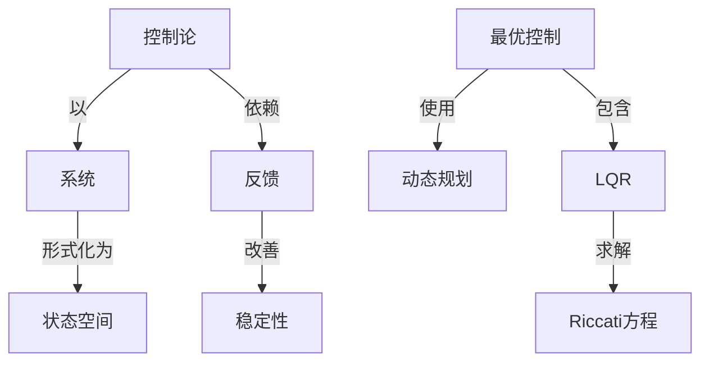

# 最优控制系统的微分方程理论

**PDF**：`C:\Users\AJ\Documents\Codex\2026-05-28\https-github-com-yangjin2021-think-model-2\[控制论].[最优控制系统的微分方程理论].pdf`  
**全文 OCR**：[[OCR全文/22-最优控制系统的微分方程理论]]  
**重点概念**：[[概念/线性系统]]、[[概念/系统]]、[[概念/最优控制]]、[[概念/状态空间]]、[[概念/控制论]]、[[概念/动态规划]]、[[概念/稳定性]]、[[概念/非线性系统]]、[[概念/LQR]]、[[概念/Kalman滤波]]、[[概念/反馈]]、[[概念/信号处理]]、[[概念/Riccati方程]]

## 本书定位

从微分方程角度研究最优轨迹、伴随系统和边值问题。

## 整理大纲

1. 受控微分方程
2. 伴随系统
3. 两点边值问题
4. 切换函数
5. 稳定和扰动

## OCR 识别到的目录/章节线索

- 目录
- 绪论
- 第一章
- 第二章
- 引言
- 08...
- 第三章
- 第五章
- 第六章
- 附录1
- 附录2
- 附录3布劳维尔不动点定理
- 附录4菲利浦夫引理
- 附录5波赫纳积分
- 附录6最大值原理的非光滑分析证明
- 参考文献
- (1.&ewn)、第有尼级(G,W,Tebnin),洛事路(I/Bopi)
- 第一章微分方程预备知识
- 第二章线性系统的最优控制
- 0., is)1i s>0,
- 8.1
- (0.()=0,
- 第三章庞特里雅金的最大值原理
- 第二章已时论了），1961年，怕科维装用古典变分学方法推导由
- 第四章将始白最大值不用的严格证明
- 0.8@, (0)
- 0.（0.（0）+
- (0.（4）=0,
- 第四章最大值原理的证明
- 0. =f(0, e(0, s(0),
- 1.50
- 3.M, bn,(-) I9
- 0.0）
- 1.正不含在否链的内部，9是正名F的会共点错公情
- 0.-0
- 1.U是取值为U的有是时则函数全体，在其中引进距离
- 第五章最优控制的近似计算方法
- 一.下面片定是等决（以）的收教民题的.
- 0.之，求解量优疫制网组(1)~（14)转化为求解那式如下的
- 8.于是/</(a),且/()的连续性择J</(x)=J.组度5
- 第六章分布参数系统的最优控制
- (7).(8)的产义解或特解,
- 附录1巴拿空间
- 1.1
- 1.如果（）：[a，的]R是可积的，劳Ⅱ
- 1.]<1,得对任有f∈x*,1/<1,在{)中有于月U-使
- 附录2变分学基础
- 20.（0.00）-6.

## 重要理论与工具

- 常微分方程
- Hamilton 系统
- 伴随方程
- 切换函数
- 射击法

## 重点概念频次

- [[概念/线性系统]]：140
- [[概念/系统]]：117
- [[概念/最优控制]]：82
- [[概念/状态空间]]：62
- [[概念/控制论]]：11
- [[概念/动态规划]]：7
- [[概念/稳定性]]：3
- [[概念/非线性系统]]：3
- [[概念/LQR]]：3
- [[概念/Kalman滤波]]：2
- [[概念/反馈]]：1
- [[概念/信号处理]]：1
- [[概念/Riccati方程]]：1

## 理论关系链接

- [[概念/控制论]] --以--> [[概念/系统]]
- [[概念/控制论]] --依赖--> [[概念/反馈]]
- [[概念/反馈]] --改善--> [[概念/稳定性]]
- [[概念/系统]] --形式化为--> [[概念/状态空间]]
- [[概念/最优控制]] --使用--> [[概念/动态规划]]
- [[概念/最优控制]] --包含--> [[概念/LQR]]
- [[概念/LQR]] --求解--> [[概念/Riccati方程]]

## OCR 证据摘录

### [[概念/线性系统]]
> 线性微分方程组和它的共方程组
> 线性系统的最优控制
> 线性系统的等时区城
### [[概念/系统]]
> 线性系统的最优控制
> 线性系统的等时区城
> 状态变量为线性的系统·
### [[概念/最优控制]]
> 线性系统的最优控制
> 个线性最优控制问题
> 1最优控制间题的叙述和最大值原理…..
### [[概念/状态空间]]
> 状态变量为线性的系统·
> 它的数学方程，首先是对象的动态方程，也称为系找的状态方程
> 读者可日找出上述何题中的状态方板，但别包基，的东条价，
### [[概念/控制论]]
> 最优线性反馈调节器的设计原理
> (N.Wiener）等在本世纪四十年代创立了控制论科学.其后，自
> 要求人们根据性能指标设计最优的控制系统.在数学家列萌希
### [[概念/动态规划]]
> 动态规划方法与最大值原理.
> 员尔处送用动态规划方法研究了址优控就河题，它的理论基
> 对于一款情形的最优性原理是得需至明的，对于最优控别网
### [[概念/稳定性]]
> 不统（1)）中的4可能是不稳定的，即4的特证值不全其有负
> 的我为=时，存在KGR换得4-B区是稳定的，（多第*计3
> 因此，我约银定4是稳定的，Q，8，R请足条付（3）和（0).当
### [[概念/非线性系统]]
> 定理录优时间r是非线性方表
> 全的，人们自然爱风，首面的些论对于按制变重为非线性的系统
> 解存在唯一.自然，由于方是组（）为非线性的，我们不能背定它
### [[概念/LQR]]
> 定理设v*（·），e（-)=（·,v）是线性二次优控制问题
> 1业出线性二次型是控1拍河6，次态方程5推能作标为
> 本举介期分布步数系级优控制理论初步，生要是线性二次
### [[概念/Kalman滤波]]
> Kalman}保入期究了候性系现在二次性指标下的址优视缺网
> 人们部之为具尔量方程的必要条件，卡尔曼则具体研究了线性二
