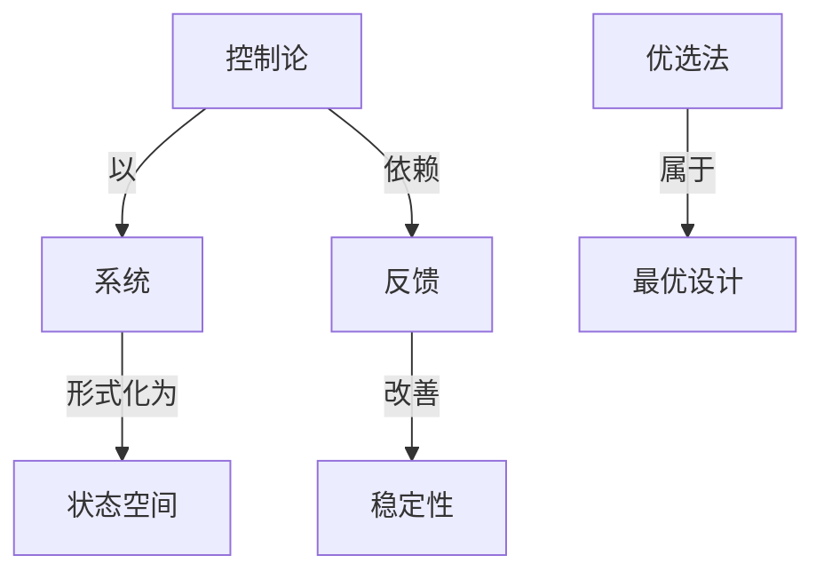

# 最优设计的数学方法

**PDF**：`C:\Users\AJ\Documents\Codex\2026-05-28\https-github-com-yangjin2021-think-model-2\[控制论].[最优设计的数学方法].pdf`  
**全文 OCR**：[[OCR全文/26-最优设计的数学方法]]  
**重点概念**：[[概念/反馈]]、[[概念/控制论]]、[[概念/线性系统]]、[[概念/非线性系统]]、[[概念/系统]]、[[概念/最优设计]]、[[概念/状态空间]]、[[概念/信道容量]]、[[概念/优选法]]、[[概念/稳定性]]、[[概念/编码]]、[[概念/动态规划]]

## 本书定位

系统讲解最优设计中的数学规划、对偶和最优性条件。

## 整理大纲

1. 优化模型
2. 无约束优化
3. 约束优化
4. 线性/非线性规划
5. 对偶和灵敏度

## OCR 识别到的目录/章节线索

- 第一章是一些必疫的数基结知识。第二章到赔六章是最优设
- 第七章计其程序中直楼族方买的一些说明。
- 第一章预备知识……
- 第二章最优化题…….·
- 第五章无约来程小业的邮析
- 第六章额小化的直推法
- 52.-N.单那显热
- 第七章计算程序……
- 附录一真楼注计机序
- 第一章预备知识
- 1.维实线性空财2
- 2.线性验立向录
- 4.矩的运算
- 5.线性方程组
- 1.库的养值
- 2.向量的范款和期阵的范数
- 2.5
- 3.一般映射的导数
- 第二章最优化问题
- 2.41-24,4,
- 一、年品，对子能，后等拍能，规道动享不层大，考是空
- 9.5[44(1 -0),
- 0.4(7),=T,<1.2(T)
- 0.046
- 239.0e5 ,8
- 1.211
- 409.2
- 2.550×10*
- 9.2787 ×19*
- 13.440
- 4.617
- 第三章数学规划及其解法
- 0.01
- 0.707
- 6.5
- 0.·0]
- 5.4
- 2.=
- 4.0
- 第四章有约束函数的极小化准则
- 8.5
- 1.2。一、1），嵌次票（4-12）各式，然后把庚得结果和
- 1.影偿
- 2.化排度方偿
- 1.多里意-约输（Fr-Joa）量分系式定理
- 2.岸题-特克（Kue-Tuker）数分形式定理
- 3.里歌-约输点定理
- 4.库题-特克款点定理
- 1.外点偿
- 2.内点法
- 1.37
- 第五章无约束极小化的解析法
- 1.35
- 9.61
- 0..
- 3. F. T.Dogp sed 1. E. Deumiy, 2, cMsta.of Cmp. 2,p- 1~g,
- 0.（b),bg
- 3.15, 0.785)
- (3.11, +.785)]
- 1.569;
- 25.195.
- (25.198, -1.569
- 1.270×10'*
- 1.0038
- 1.210 ×10° 1.149 × [0*
- 3.215
- 1.9058
- 4.848
- 1.10
- 8.815
- 34.186
- 6.091
- 6.481
- 4.901
- 0.118r
- 5.999
- 6.916
- 1.44=18
- 1.k44
- 5.083

## 重要理论与工具

- 线性规划
- 非线性规划
- KKT 条件
- 对偶理论
- 动态规划

## 重点概念频次

- [[概念/线性系统]]：141
- [[概念/非线性系统]]：13
- [[概念/系统]]：12
- [[概念/最优设计]]：11
- [[概念/状态空间]]：10
- [[概念/信道容量]]：6
- [[概念/优选法]]：5
- [[概念/稳定性]]：1
- [[概念/编码]]：1
- [[概念/动态规划]]：1

## 理论关系链接

- [[概念/控制论]] --以--> [[概念/系统]]
- [[概念/控制论]] --依赖--> [[概念/反馈]]
- [[概念/反馈]] --改善--> [[概念/稳定性]]
- [[概念/系统]] --形式化为--> [[概念/状态空间]]
- [[概念/优选法]] --属于--> [[概念/最优设计]]

## OCR 证据摘录

### [[概念/线性系统]]
> 本书的主至疗春是分绍拿解学线性规划的直接法和序列无的
> 1.维实线性空财2
> 以及零向量积更向量的存在，维出风（1）列（8）的线性运算
### [[概念/非线性系统]]
> 问起作为是一种“非线性规划”。
> 这个非线性规划间题，在投有的来条件下的据是然是x=（1，
> 所以就有必要专退使用线性规划解统的独巧末运仁地解决非线性
### [[概念/系统]]
> 向量，原序游成一列的=个实意Lt，的整体
> 个方离，可且这三个方因又是一个整体，在其体看手设计，导找
> 关于由汽轮发电礼与冷登器构成的这标一个净要系统的最优
### [[概念/最优设计]]
> 最优设计的数学方法
> 本书介绍最优设计所涉及到的最优化数学方法，重介绍近年
> 计同题的介绍，以及和最优设计有关的最优化的数学方法。第七章
### [[概念/状态空间]]
> 答要4个机器小时，所以验段1的输出状态是。
> 它表出了级末的状态，从定文可知为，他就是期下的过程。
> 状态飞的要化是由两定变量采动的，所以整个系统的
### [[概念/信道容量]]
> 购汽能机将鼠给受相对于版定的发电容量r：的消瓶，失阶
> 容量的一个次品，从面减送？活种消瓶，议式（2-44）可品用
> 可以是量决录优容量利是的向所，，和x是由到个分每个周
### [[概念/优选法]]
> o=0.618(b,-a)+h
> 关于采用费次时看数是一种最优选择的数学证明，早在1963
> 年以底，管经有检院计工作者从院计发点保意量优选统的统计
### [[概念/稳定性]]
> 式（6-25）在它的额用情况下，多角形泵点内F（x）的约束稳定
