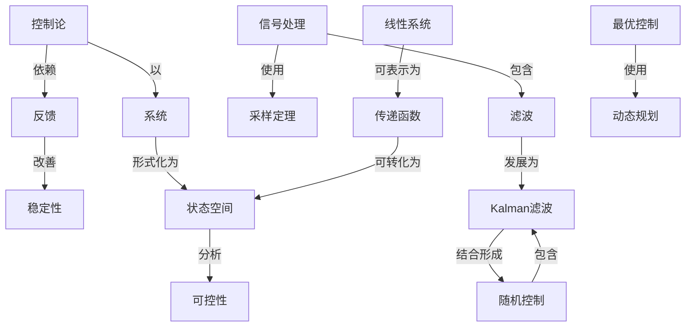

# 现代控制理论基础

**PDF**：`C:\Users\AJ\Documents\Codex\2026-05-28\https-github-com-yangjin2021-think-model-2\[控制论].[现代控制理论基础].pdf`  
**全文 OCR**：[[OCR全文/30-现代控制理论基础]]  
**重点概念**：[[概念/系统]]、[[概念/状态空间]]、[[概念/线性系统]]、[[概念/最优控制]]、[[概念/可控性]]、[[概念/控制论]]、[[概念/Kalman滤波]]、[[概念/采样定理]]、[[概念/滤波]]、[[概念/动态规划]]、[[概念/传递函数]]、[[概念/随机控制]]、[[概念/稳定性]]、[[概念/信号处理]]、[[概念/非线性系统]]、[[概念/反馈]]

## 本书定位

建立现代控制理论的基础框架：状态空间、稳定性、最优和估计。

## 整理大纲

1. 状态空间
2. 可控可观
3. Lyapunov 稳定性
4. 状态反馈
5. 最优控制和滤波

## OCR 识别到的目录/章节线索

- 目录
- 第一章
- 第二节
- 第三节
- 第六节
- 第七节
- 第二章
- 第一节
- 第四节
- 第五节
- 第三章
- 第七节对偶原理
- 第八节能控标准形与能观测标准形
- 第四章变分法与最优控制
- 第五章
- 第六章
- 第七章
- 第三节燃料控制系统
- 99......
- 第八章基本估计理论
- 第九章
- 附录一矩阵微分法
- 附录二矩阵恒等式
- 第一章状态方程
- 第一节基本念
- 第二节化高阶微分方程为状态方程
- 1.控标准形
- 2.能见系标准形
- 8., =., -a,A.= . =a,- - .A
- 第三节由传递函数求状态方程
- 第四节由状态方程求传递函数
- 1.7
- 1.] /r'+2+3 1+ 2 1
- 第五节状态变量图
- 8.报图这个状态变量图及过来可目写出动当方程为
- 第六节高散系统的状态方程
- 第七节多输入多输出系统的状态方程
- 1.2降指数的性质
- 1.板据能件指数的定义，宜接得到证明
- 3.根娠阵指数的定文，有
- 4.利用上述结乘直接得出
- 5.权则定文我们有
- 6.由于P是非奇并矩阵，P-存在。根据定文则得
- 第二节阵指数
- 2.2粒民变换法
- 1.对角标准形这种标珠形是
- 2.和4可以相等，提，和，是映立的
- 9.看当标难形首面读过，看矩阵4的·个特征值互不
- 10..0
- 3.模态形已经指自过，当题阵有复数特征值时，预然
- 1.以素-哈密顿定理
- 2.频指数的多项式表示式
- 3.矩阵指数的计算
- 第三节非齐次状态方程的解
- 1.特移中4，读是柜厚微分方程
- 2.转移矩尊存三条重要的性兵，分述如下。
- 第五节线性时变系统状态方程的解
- 5.2状态转移方程
- 1.13 -
- 第六节线性离散系统状态方程的解
- 6.1真致状态转移方程
- 1.道殖法观在用道推读求解商款代态方程，
- 2.7变费法现在用Z变换法案钢真款状态方积，在以
- 9.8(- 0.2)*+ 0.8(-0,8)*
- 1.3
- 1.6
- 0.8-x）+4
- 0.6 +1,<
- 1.[ ( 0.2) + 4( 0.8)*
- 17.6
- 0.8
- 0.8±
- 3.8
- 1.线性时变系统态方程的离敬业设系统的状态方积为
- 5.411
- 2.线性定公系成状态方程的高发化收系统的状方程为
- 第三章能控性与能观测性
- 第一节线性代数方程组
- 第二节线性定常离散系统的能控性
- 第三节线性定常连续系统的能控性

## 重要理论与工具

- 现代控制
- Kalman 理论
- Lyapunov
- LQR
- Kalman 滤波

## 重点概念频次

- [[概念/系统]]：470
- [[概念/状态空间]]：420
- [[概念/线性系统]]：169
- [[概念/最优控制]]：54
- [[概念/可控性]]：36
- [[概念/控制论]]：23
- [[概念/Kalman滤波]]：14
- [[概念/采样定理]]：11
- [[概念/滤波]]：10
- [[概念/动态规划]]：10
- [[概念/传递函数]]：6
- [[概念/随机控制]]：5
- [[概念/稳定性]]：3
- [[概念/信号处理]]：3
- [[概念/非线性系统]]：2
- [[概念/反馈]]：1
- [[概念/可观测性]]：1

## 理论关系链接

- [[概念/控制论]] --以--> [[概念/系统]]
- [[概念/控制论]] --依赖--> [[概念/反馈]]
- [[概念/反馈]] --改善--> [[概念/稳定性]]
- [[概念/信号处理]] --使用--> [[概念/采样定理]]
- [[概念/信号处理]] --包含--> [[概念/滤波]]
- [[概念/滤波]] --发展为--> [[概念/Kalman滤波]]
- [[概念/系统]] --形式化为--> [[概念/状态空间]]
- [[概念/状态空间]] --分析--> [[概念/可控性]]
- [[概念/线性系统]] --可表示为--> [[概念/传递函数]]
- [[概念/传递函数]] --可转化为--> [[概念/状态空间]]
- [[概念/最优控制]] --使用--> [[概念/动态规划]]
- [[概念/Kalman滤波]] --结合形成--> [[概念/随机控制]]
- [[概念/随机控制]] --包含--> [[概念/Kalman滤波]]

## OCR 证据摘录

### [[概念/系统]]
> 离敬系统的状态方程
> 多输入多输出系统的状态方程
> 线性时变系统状态方程的解
### [[概念/状态空间]]
> 化高阶微分方程为状态方程
> 由传邀函数求状态方程
> 由状态方程求传递函数
### [[概念/线性系统]]
> 线性定常齐次状态方程的解
> 线性时变系统状态方程的解
> 线性离散系统状志方程的解
### [[概念/最优控制]]
> 第四章变分法与最优控制
> 线性最优控制系统
> 二次型性能指标的最优控制问题
### [[概念/可控性]]
> 能控性与能现测性
> 线性定常高散系统的能控性
> 线性定常连续系统的能控性
### [[概念/控制论]]
> 线性最优控制系统
> 第三节燃料控制系统
> 优包用求研充控制系统时它具有加下的优点
### [[概念/Kalman滤波]]
> 离散系统卡尔曼滤波
> 连续系统的卡尔曼滤波
> 圆性两者之间的买票，我的稿介绍山卡尔曼建立的对得原现。
### [[概念/采样定理]]
> （1）适用于多输入多险出、时变、非线性、随机，采样
> 一般的数字计再机控制系统和采样系统多属离款系统，
> 时方程在采样时刷的近仁服。
### [[概念/滤波]]
> 离散系统卡尔曼滤波
> ~般线性离散系统的滤波
> 连续系统的卡尔曼滤波
### [[概念/动态规划]]
> 变分方法、最大值原理与动态规划
> 要智息，最优性原理所有定的是，余下的决策是最优决
> 武本例元。按组最优性原理尺确定停列（-0.5，00是
